# 国产麒麟系统部署Ambari + HDP

系统版本	Kylin Linux 
系统架构	x86_64
ambari	ambari-2.7.5.0-centos7.tar.gz
HDP	HDP-3.1.5.0-centos7-rpm.tar.gz
HDP-GPL-3.1.5.0-centos7-gpl.tar.gz
HDP-UTILS-1.1.0.22-centos7.tar.gz

## 一、安装麒麟系统


## 二、安装包准备


## 三、环境设置

### 3.1 环境设置（所有节点）

#### 1.关闭防火墙

```shell
systemctl stop firewalld.service
systemctl disable firewalld.service
systemctl status firewalld.service
```

#### 2.关闭selinux服务(必须重启才能生效，所有节点)

```shell
vim /etc/selinux/config

SELINUX=disabled
```

vim 检查selinux状态

```
sestatus -v
SELinux status: disabled 表示已经关闭了
```

#### 3.修改主机映射(所有节点)

```bash
vim /etc/hosts

127.0.0.1   localhost localhost.localdomain localhost4 localhost4.localdomain4
   ::1     localhost localhost.localdomain localhost6 localhost6.localdomain6
192.168.0.111 master
192.168.0.112 node1
192.168.0.113 node2
192.168.0.114 node3
192.168.0.115 node4


10.8.40.60 vm60
10.8.40.61 vm61
10.8.40.62 vm62


```

#### 4.修改主机名称(所有节点)

```shell
vim /etc/hostname

master
```

#### 5.重启服务(所有节点)

`/etc/init.d/network restart(等价与service network restart)`

#### 6.配置limits.conf

```
vim /etc/security/limits.conf

* soft nofile 65536 
* hard nofile 65536
* soft nproc 401408 
* hard nproc 401408 
nexus - nofile 65536
```

#### 7.永久配置sysctl.conf（所有节点）

设置此参数主要是对linux和类Unix系统服务器交换区进行调整，通常设置的小是为了减少使用交换空间的概率)

```
echo "vm.swappiness=2" >> /etc/sysctl.conf 

vim /etc/rc.d/rc.local 
if test -f /sys/kernel/mm/transparent_hugepage/enabled; then
    echo never > /sys/kernel/mm/transparent_hugepage/enabled
fi
if test -f /sys/kernel/mm/transparent_hugepage/defrag; then
    echo never > /sys/kernel/mm/transparent_hugepage/defrag
fi
```

#### 8.ssh免密登陆配置

```java
//生成密钥
ssh-keygen -t rsa

//在主节点将id_rsa.pub写入authorized_keys
cat ~/.ssh/id_rsa.pub >> ~/.ssh/authorized_keys
chmod 600 ~/.ssh/authorized_keys

ssh localhost (需要输入密码)

//将所有的节点伤的id_rsa.pub文件拷到 ~/.ssh文件夹下(子节点上面操作,需要输入密码)
scp ~/.ssh/id_rsa.pub  root@master:~/.ssh/id_rsa_node1.pub
scp ~/.ssh/id_rsa.pub  root@master:~/.ssh/id_rsa_node2.pub
scp ~/.ssh/id_rsa.pub  root@master:~/.ssh/id_rsa_node3.pub
scp ~/.ssh/id_rsa.pub  root@master:~/.ssh/id_rsa_node4.pub

//主节点上执行命令,将其他的.pub文件写入authorized_keys
cat ~/.ssh/id_rsa_node1.pub >>  ~/.ssh/authorized_keys
cat  ~/.ssh/id_rsa_node2.pub >>  ~/.ssh/authorized_keys
cat  ~/.ssh/id_rsa_node3.pub >>  ~/.ssh/authorized_keys
cat  ~/.ssh/id_rsa_node4.pub >>  ~/.ssh/authorized_keys

//将主节点的authorized_keys分发至每个从节点上，并给予此文件600的权限
scp ~/.ssh/authorized_keys  root@node1:~/.ssh/
scp ~/.ssh/authorized_keys  root@node2:~/.ssh/
scp ~/.ssh/authorized_keys  root@node3:~/.ssh/
scp ~/.ssh/authorized_keys  root@node4:~/.ssh/
chmod 600 ~/.ssh/authorized_keys
```

```shell
//生成密钥
ssh-keygen -t rsa

//在主节点将id_rsa.pub写入authorized_keys
cat ~/.ssh/id_rsa.pub >> ~/.ssh/authorized_keys
chmod 600 ~/.ssh/authorized_keys

ssh localhost (需要输入密码)

//将所有的节点伤的id_rsa.pub文件拷到 ~/.ssh文件夹下(子节点上面操作,需要输入密码)
scp ~/.ssh/id_rsa.pub  root@vm60:~/.ssh/id_rsa_vm60.pub
scp ~/.ssh/id_rsa.pub  root@vm60:~/.ssh/id_rsa_vm61.pub
scp ~/.ssh/id_rsa.pub  root@vm60:~/.ssh/id_rsa_vm62.pub


//主节点上执行命令,将其他的.pub文件写入authorized_keys
cat ~/.ssh/id_rsa_vm60.pub >>  ~/.ssh/authorized_keys
cat  ~/.ssh/id_rsa_vm61.pub >>  ~/.ssh/authorized_keys
cat  ~/.ssh/id_rsa_vm62.pub >>  ~/.ssh/authorized_keys


//将主节点的authorized_keys分发至每个从节点上，并给予此文件600的权限
scp ~/.ssh/authorized_keys  root@vm60:~/.ssh/
scp ~/.ssh/authorized_keys  root@vm61:~/.ssh/
scp ~/.ssh/authorized_keys  root@vm62:~/.ssh/

chmod 600 ~/.ssh/authorized_keys
```


#### 9.修改系统最大打开文件数

```
vim /etc/systemd/system.conf
[Manager]
DefaultLimitNOFILE=1024000          
DefaultLimitNPROC=1024000
```

ulimit -a 查看

#### 10.重启机器

```
reboot
```


### 3.2 JDK卸载与安装（所有节点执行）

麒麟系统自带有JDK1.8和JDK11两个版本，这两个版本都需要卸载并重新安装

```bash
rpm -qa|grep java
rpm -e --nodeps java-1.8.0-openjdk-1.8.0.242.b08-1.h5.ky10.x86_64
rpm -e --nodeps java-1.8.0-openjdk-headless-1.8.0.242.b08-1.h5.ky10.x86_64
rpm -e --nodeps java-11-openjdk-headless-11.0.6.10-4.ky10.ky10.x86_64
rpm -e --nodeps java-11-openjdk-11.0.6.10-4.ky10.ky10.x86_64
```

部署

```shell

vim /etc/profile

JAVA_HOME=/usr/java/jdk1.8.0_152
CLASSPATH=$JAVA_HOME/lib/
PATH=$PATH:$JAVA_HOME/bin
export PATH JAVA_HOME CLASSPATH
```

### 3.3、YUM源设置(离线安装需要配置)

#### 1.配置本地Ambari+HDP的yum源

```shell
yum  install yum-utils -y
yum repolist
yum install createrepo -y
```

#### 2.安装httpd服务器

```shell
yum -y install httpd
systemctl restart httpd
systemctl enable httpd
```

#### 3.将准备的HDP安装包放到/var/www/html目录下

```shell
[root@master ~]# cd /var/www/html/
[root@master html]# mkdir ambari
拷贝文件到ambari下面
[root@master html]# cd ambari/
[root@master ambari]# ls
ambari-2.6.0.0-centos7.tar.gz  HDP-2.6.3.0-centos7-rpm.tar.gz  HDP-UTILS-1.1.0.21-centos7.tar.gz
[root@master ambari]# tar -zxvf ambari-2.6.0.0-centos7.tar.gz
[root@master ambari]# tar -zxvf HDP-2.6.3.0-centos7-rpm.tar.gz 
[root@master ambari]# mkdir HDP-UTILS
[root@master ambari]# tar -zxvf HDP-UTILS-1.1.0.21-centos7.tar.gz -C HDP-UTILS
[root@master ambari]# rm -rf ambari-2.6.0.0-centos7.tar.gz HDP-2.6.3.0-centos7-rpm.tar.gz HDP-UTILS-1.1.0.21-centos7.tar.gz 
[root@master ambari]# ls
ambari  HDP  HDP-UTILS
```

```shell
tar -zxvf ambari-2.7.5.0-centos7.tar.gz -C /var/www/html/
tar -zxvf HDP-3.1.5.0-centos7-rpm.tar.gz -C /var/www/html/
tar -zxvf HDP-GPL-3.1.5.0-centos7-gpl.tar.gz -C /var/www/html/
tar -zxvf HDP-UTILS-1.1.0.22-centos7.tar.gz -C /var/www/html/
mkdir /var/www/html/libtrpc
mv libtirpc-0.2.4-0.16.el7.x86_64.rpm /var/www/html/libtrpc
mv libtirpc-devel-0.2.4-0.16.el7.x86_64.rpm /var/www/html/libtrpc
cd /var/www/html/libtrpc
createrepo . 
```


#### 制作yum源

```shell
# 制作本地YUM源
vim /etc/yum.repos.d/ambari.repo

[Ambari-2.7.5.0]
name=Ambari-2.7.5.0
baseurl=http://vm60/ambari/centos7/2.7.5.0-72/
gpgcheck=0
enabled=1
priority=1


vim /etc/yum.repos.d/HDP.repo
[HDP-3.1.5.0]
name=HDP Version - HDP-3.1.5.0
baseurl=http://vm60/HDP/centos7/3.1.5.0-152/
gpgcheck=0
enabled=1
priority=1

[HDP-UTILS-1.1.0.22]
name=HDP-UTILS Version - HDP-UTILS-1.1.0.22
baseurl=http://vm60/HDP-UTILS/centos7/1.1.0.22/
gpgcheck=0
enabled=1
priority=1

[HDP-GPL-3.1.5.0]
name=HDP-GPL Version - HDP-GPL-3.1.5.0
baseurl=http://vm60/HDP-GPL/centos7/3.1.5.0-152
gpgcheck=0
enabled=1
priority=1

vim /etc/yum.repos.d/libtrpc.repo
[libtirpc_repo]
name=libtirpc-0.2.4-0.16
baseurl=http://vm60/libtrpc/
gpgcheck=0
enabled=1
priority=1


```


#### 4.yum文件分发

```shell
scp  /etc/yum.repos.d/ambari.repo vm61:/etc/yum.repos.d/
scp  /etc/yum.repos.d/HDP.repo vm61:/etc/yum.repos.d/
scp  /etc/yum.repos.d/libtrpc.repo vm61:/etc/yum.repos.d/

scp  /etc/yum.repos.d/ambari.repo vm62:/etc/yum.repos.d/
scp  /etc/yum.repos.d/HDP.repo vm62:/etc/yum.repos.d/
scp  /etc/yum.repos.d/libtrpc.repo vm62:/etc/yum.repos.d/
```


#### 5.更新makecache

```shell
#分别在每台机器上执行：
cd /etc/yum.repos.d/
yum clean all 
yum makecache
```


```shell
# 安装HTTP服务

yum -y install httpd
systemctl restart httpd
systemctl enable httpd
# 将ambari + HDP安装包上传至服务器
tar -zxvf ambari-2.7.5.0-centos7.tar.gz -C /var/www/html/
tar -zxvf HDP-3.1.5.0-centos7-rpm.tar.gz -C /var/www/html/
tar -zxvf HDP-GPL-3.1.5.0-centos7-gpl.tar.gz -C /var/www/html/
tar -zxvf HDP-UTILS-1.1.0.22-centos7.tar.gz -C /var/www/html/
mkdir /var/www/html/libtrpc
mv libtirpc-0.2.4-0.16.el7.x86_64.rpm /var/www/html/libtrpc
mv libtirpc-devel-0.2.4-0.16.el7.x86_64.rpm /var/www/html/libtrpc
cd /var/www/html/libtrpc
createrepo . 


# 制作本地YUM源
vim /etc/yum.repos.d/ambari.repo

[Ambari-2.7.5.0]
name=Ambari-2.7.5.0
baseurl=http://vm60/ambari/centos7/2.7.5.0-72/
gpgcheck=0
enabled=1
priority=1


vim /etc/yum.repos.d/HDP.repo
[HDP-3.1.5.0]
name=HDP Version - HDP-3.1.5.0
baseurl=http://vm60/HDP/centos7/3.1.5.0-152/
gpgcheck=0
enabled=1
priority=1

[HDP-UTILS-1.1.0.22]
name=HDP-UTILS Version - HDP-UTILS-1.1.0.22
baseurl=http://vm60/HDP-UTILS/centos7/1.1.0.22/
gpgcheck=0
enabled=1
priority=1

[HDP-GPL-3.1.5.0]
name=HDP-GPL Version - HDP-GPL-3.1.5.0
baseurl=http://vm60/HDP-GPL/centos7/3.1.5.0-152
gpgcheck=0
enabled=1
priority=1

vim /etc/yum.repos.d/libtrpc.repo
[libtirpc_repo]
name=libtirpc-0.2.4-0.16
baseurl=http://vm60/libtrpc/
gpgcheck=0
enabled=1
priority=1


scp  /etc/yum.repos.d/ambari.repo vm61:/etc/yum.repos.d/
scp  /etc/yum.repos.d/HDP.repo vm61:/etc/yum.repos.d/
scp  /etc/yum.repos.d/libtrpc.repo vm61:/etc/yum.repos.d/

scp  /etc/yum.repos.d/ambari.repo vm62:/etc/yum.repos.d/
scp  /etc/yum.repos.d/HDP.repo vm62:/etc/yum.repos.d/
scp  /etc/yum.repos.d/libtrpc.repo vm62:/etc/yum.repos.d/

#分别在每台机器上执行：
cd /etc/yum.repos.d/
yum clean all 
yum makecache

```

##  四、安装基础服务（主节点执行）

### 4.1 MySQL安装部署和元数据初始化（主节点执行）

mysql-5.7.17-linux-glibc2.5-x86_64.tar安装

#### 1.初始化配置

##### 解压

```shell
mkdir -p /usr/local/mysql
tar -zxvf mysql-5.7.17-linux-glibc2.5-x86_64.tar.gz
mv mysql-5.7.17-linux-glibc2.5-x86_64/* /usr/local/mysql/
```

##### 创建data目录

```shell
//二、创建data目录
mkdir -p /usr/local/mysql/data
mkdir -p /usr/local/mysql/log
mkdir -p /usr/local/mysql/tmp
```

##### 创建用户和组

```shell
//三、创建用户和组
groupadd mysql
useradd mysql -g mysql
chown -R mysql.mysql /usr/local/mysql/
```

##### 初始化

```shell
//四、初始化
//1、调整操作系统的open files限制
vim /etc/security/limits.conf

hard nofile 65535
soft nofile 65535

cd /usr/local/mysql
./bin/mysql_install_db --user=mysql --basedir=/usr/local/mysql/ --datadir=/usr/local/mysql/data/
```

##### 复制配置文件

```shell
//五、复制配置文件到 /etc/my.cnf
cp -a /usr/local/mysql/support-files/my-default.cnf /etc/my.cnf (选择y)
```

#### 2.修改配置文件

##### 修改my.cnf

vim /etc/my.cnf

```bash
[mysqld]

basedir = /usr/local/mysql
datadir = /usr/local/mysql/data
port = 3306
socket = /tmp/mysql.sock
character-set-server = utf8
max_allowed_packet = 200M
group_concat_max_len=4294967295
sql_mode = STRICT_TRANS_TABLES,NO_ZERO_IN_DATE,NO_ZERO_DATE,ERROR_FOR_DIVISION_BY_ZERO,NO_AUTO_CREATE_USER,NO_ENGINE_SUBSTITUTION


七、启动mysql
/usr/local/mysql/support-files/mysql.server start

//设置开机自启动
cp /usr/local/mysql/support-files/mysql.server /etc/init.d/mysql
//赋予可执行权限
chmod +x /etc/init.d/mysql   
//添加服务
chkconfig --add mysql 
//显示服务列表
chkconfig --list
//如果看到mysql服务3,4,5都是on,则成功.否则执行如下语句
chkconfig --level 345 mysql on

//重启机器,查看开机启动是否设置成功
netstat -na | grep 3306

cat /root/.mysql_secret --查看初始化自动生成的密码,并记录下来,等会登陆mysql需要

八、登录并修改密码

skip-grant-tables

bin/mysql -uroot -p  --把刚刚复制的密码粘贴上来

mysql> SET PASSWORD  FOR 'root'@localhost = PASSWORD('root');--重置密码

use mysql;
update user set host='%' where user='root';
flush privileges;

netstat -nlp  --查看3306端口是否开通
```

##### 加入环境变量

```shell
vim /etc/profile
export PATH=$PATH:/usr/local/mysql/bin
source /etc/profile


mysql文件备份
mysqldump -uroot -p db.name > aa.sql
```


#### 3.创建hdp数据库和配置

```shell
mysql -uroot -proot 

use mysql;
grant all privileges on *.* to 'root'@'%' identified by 'root' with grant option;

create database hive DEFAULT CHARSET utf8 COLLATE utf8_general_ci;
create database amon DEFAULT CHARSET utf8 COLLATE utf8_general_ci;
create database hue DEFAULT CHARSET utf8 COLLATE utf8_general_ci;
create database monitor DEFAULT CHARSET utf8 COLLATE utf8_general_ci;
create database oozie DEFAULT CHARSET utf8 COLLATE utf8_general_ci;
grant all on *.* to root@"%" Identified by "root";
```


```shell
# 修改root密码
use mysql
update mysql.user set authentication_string=password('Klbr9780') where user='root' and host='%';
flush privileges;
```


### 4.2 时间服务器同步

#### 1.master节点

```bash
# master节点执行
yum -y install chrony

vim /etc/chrony.conf
  server 192.168.110.130 iburst
  allow 192.168.119.0/24 
  local stratum 10

systemctl restart chronyd.service
systemctl enable chronyd.service

# 查看时间同步状态
chronyc -a makestep
chronyc sourcestats
chronyc sources -v

```


#### 2.其他节点

```shell
# 其他节点执行
yum -y install chrony
vim /etc/chrony.conf
	server 192.168.110.130 iburst

systemctl restart chronyd.service
systemctl enable chronyd.service

```


### 


## 五、Ambari-Server部署


#### 5.1、安装ambari-server

```shell
sudo yum install -y ambari-server 
```

```shell
cp /ztgx-jx/HDP3.1.5/mysql-connector-java-5.1.40/mysql-connector-java-5.1.40-bin.jar  /usr/share/java/
cp /ztgx-jx/HDP3.1.5/mysql-connector-java-5.1.40/mysql-connector-java-5.1.40-bin.jar  /var/lib/ambari-server/resources

vim  /etc/ambari-server/conf/ambari.properties
server.jdbc.driver.path=/usr/share/java/

```


#### 5.2、解决系统上的问题

关键信息来了：yum 安装完server后，需要修改ambari-server的系统检查设置
一共需要修改三处信息:

##### os_check.py

**vim /usr/lib/ambari-server/lib/ambari_commons/os_check.py**
第一处：在80行左右相似格式的地方插入如下代码(注意格式对齐)

```shell
_IS_KYLIN_LINUX = os.path.exists('/etc/kylin-release')
```


第二处：在90行左右相似格式的地方插入如下代码

```python
def _is_kylin_linux():
    return _IS_KYLIN_LINUX
```

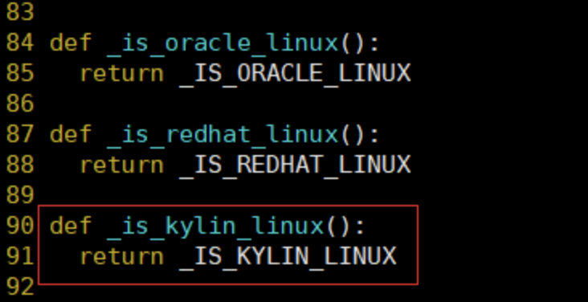

第三处：在210行左右相似格式的地方插入如下代码

```python
elif _is_kylin_linux():
	distribution =("centos","7","core")
```

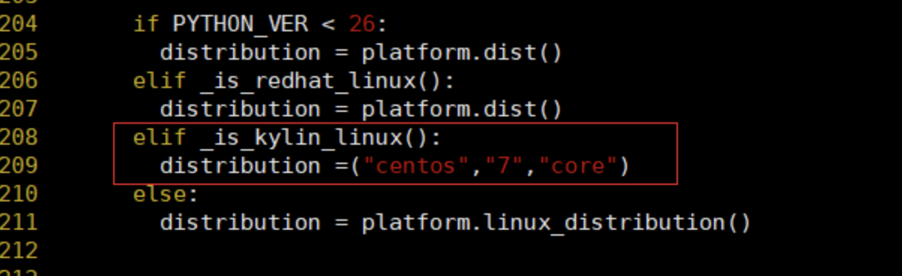


#### 5.3、配置ambari-server

```shell
ambari-server setup --jdbc-db=mysql --jdbc-driver= /usr/share/java/mysql-connector-java-5.1.40-bin.jar 
```


```shell

ambari-server setup
[root@master software]# ambari-server setup
Using python  /usr/bin/python
Setup ambari-server
Checking SELinux...
SELinux status is 'disabled'
Customize user account for ambari-server daemon [y/n] (n)? 
Adjusting ambari-server permissions and ownership...
Checking firewall status...
Checking JDK...
[1] Oracle JDK 1.8 + Java Cryptography Extension (JCE) Policy Files 8
[2] Custom JDK
==============================================================================
Enter choice (1): 2
WARNING: JDK must be installed on all hosts and JAVA_HOME must be valid on all hosts.
WARNING: JCE Policy files are required for configuring Kerberos security. If you plan to use Kerberos,please make sure JCE Unlimited Strength Jurisdiction Policy Files are valid on all hosts.
Path to JAVA_HOME: /usr/java/jdk1.8.0_152
Validating JDK on Ambari Server...done.
Check JDK version for Ambari Server...
JDK version found: 8
Minimum JDK version is 8 for Ambari. Skipping to setup different JDK for Ambari Server.
Checking GPL software agreement...
GPL License for LZO: https://www.gnu.org/licenses/old-licenses/gpl-2.0.en.html
Enable Ambari Server to download and install GPL Licensed LZO packages [y/n] (n)? 
Completing setup...
Configuring database...
Enter advanced database configuration [y/n] (n)? y
Configuring database...
==============================================================================
Choose one of the following options:
[1] - PostgreSQL (Embedded)
[2] - Oracle
[3] - MySQL / MariaDB
[4] - PostgreSQL
[5] - Microsoft SQL Server (Tech Preview)
[6] - SQL Anywhere
[7] - BDB
==============================================================================
Enter choice (1): 3
Hostname (localhost): 
Port (3306): 
Database name (ambari): 
Username (ambari): root
Enter Database Password (bigdata): 
Re-enter password: 
Configuring ambari database...
Configuring remote database connection properties...
WARNING: Before starting Ambari Server, you must run the following DDL directly from the database shell to create the schema: /var/lib/ambari-server/resources/Ambari-DDL-MySQL-CREATE.sql
Proceed with configuring remote database connection properties [y/n] (y)? y
Extracting system views...
ambari-admin-2.7.5.0.72.jar
....
Ambari repo file doesn't contain latest json url, skipping repoinfos modification
Adjusting ambari-server permissions and ownership...
Ambari Server 'setup' completed successfully.

```


#### 5.4、配置MySQL表

mysql -uroot -proot

```sql
create database ambari;
use ambari;
source /var/lib/ambari-server/resources/Ambari-DDL-MySQL-CREATE.sql;
```

#### 5.5、安装ambari-agent (所有节点)

```shell
yum -y install ambari-agent
vim /etc/ambari-agent/conf/ambari-agent.ini

systemctl start ambari-agent
```


#### 5.6、启动ambari-server

```shell
#启动
ambari-server restart
 
#停止
ambari-server   stop
```


如果启动超时停止

修改等待时间

vim /etc/ambari-server/conf/ambari.properties

\#增加

server.startup.web.timeout=120


## 六、可视化界面配置

访问 http://vm60:8080

### 0  Get Started 设置集群名称


### 1  Select Version 选择版本

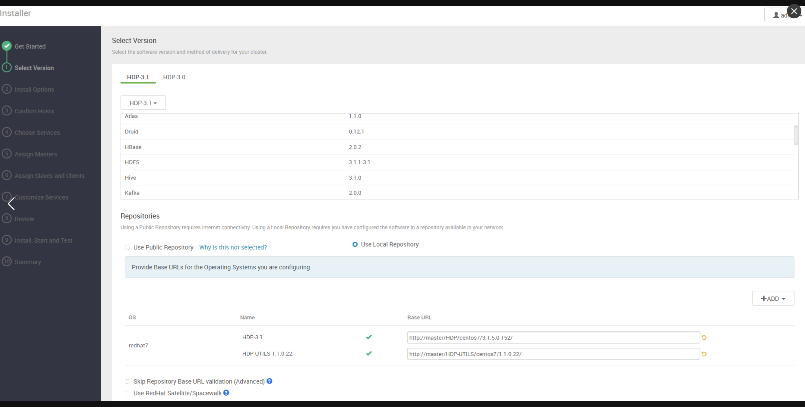

### 2 Install Option

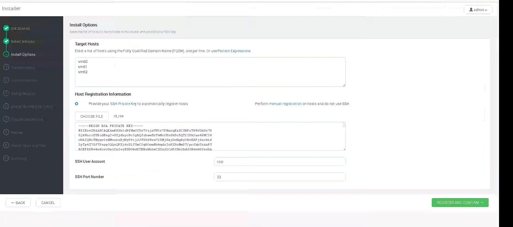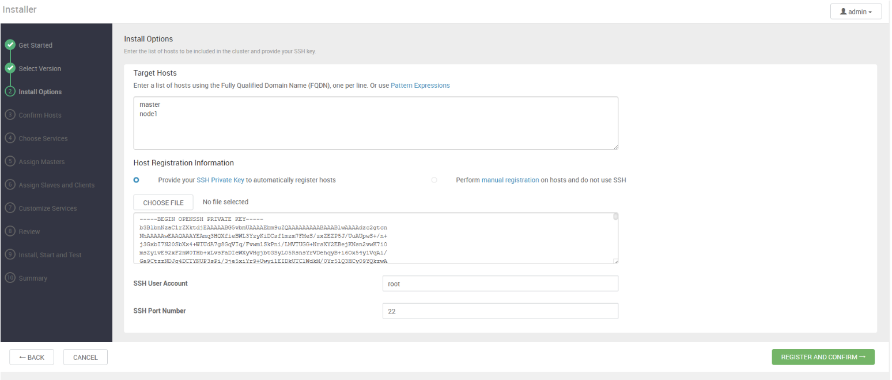


```shell
==========================
Creating target directory...
==========================

Command start time 2023-12-22 10:30:05

Connection to vm61 closed.
SSH command execution finished
host=vm61, exitcode=0
Command end time 2023-12-22 10:30:05

==========================
Copying ambari sudo script...
==========================

Command start time 2023-12-22 10:30:05

scp /var/lib/ambari-server/ambari-sudo.sh
host=vm61, exitcode=0
Command end time 2023-12-22 10:30:05

==========================
Copying common functions script...
==========================

Command start time 2023-12-22 10:30:05

scp /usr/lib/ambari-server/lib/ambari_commons
host=vm61, exitcode=0
Command end time 2023-12-22 10:30:06

==========================
Copying create-python-wrap script...
==========================

Command start time 2023-12-22 10:30:06

scp /var/lib/ambari-server/create-python-wrap.sh
host=vm61, exitcode=0
Command end time 2023-12-22 10:30:06

==========================
Copying OS type check script...
==========================

Command start time 2023-12-22 10:30:06

scp /usr/lib/ambari-server/lib/ambari_server/os_check_type.py
host=vm61, exitcode=0
Command end time 2023-12-22 10:30:06

==========================
Running create-python-wrap script...
==========================

Command start time 2023-12-22 10:30:06

Connection to vm61 closed.
SSH command execution finished
host=vm61, exitcode=0
Command end time 2023-12-22 10:30:06

==========================
Running OS type check...
==========================

Command start time 2023-12-22 10:30:06
Cluster primary/cluster OS family is redhat7 and local/current OS family is redhat7

Connection to vm61 closed.
SSH command execution finished
host=vm61, exitcode=0
Command end time 2023-12-22 10:30:06

==========================
Checking 'sudo' package on remote host...
==========================

Command start time 2023-12-22 10:30:06

Connection to vm61 closed.
SSH command execution finished
host=vm61, exitcode=0
Command end time 2023-12-22 10:30:07

==========================
Copying repo file to 'tmp' folder...
==========================

Command start time 2023-12-22 10:30:07

scp /etc/yum.repos.d/ambari.repo
host=vm61, exitcode=0
Command end time 2023-12-22 10:30:07

==========================
Moving file to repo dir...
==========================

Command start time 2023-12-22 10:30:07

Connection to vm61 closed.
SSH command execution finished
host=vm61, exitcode=0
Command end time 2023-12-22 10:30:07

==========================
Changing permissions for ambari.repo...
==========================

Command start time 2023-12-22 10:30:07

Connection to vm61 closed.
SSH command execution finished
host=vm61, exitcode=0
Command end time 2023-12-22 10:30:07

==========================
Copying setup script file...
==========================

Command start time 2023-12-22 10:30:07

scp /usr/lib/ambari-server/lib/ambari_server/setupAgent.py
host=vm61, exitcode=0
Command end time 2023-12-22 10:30:07

==========================
Running setup agent script...
==========================

Command start time 2023-12-22 10:30:07
("INFO 2023-12-22 10:30:42,441 NetUtil.py:123 - Stop event received
INFO 2023-12-22 10:30:42,441 main.py:481 - Connecting to Ambari server at https://vm61:8440 (10.8.40.61)
INFO 2023-12-22 10:30:42,441 NetUtil.py:61 - Connecting to https://vm61:8440/ca
WARNING 2023-12-22 10:30:42,442 NetUtil.py:92 - Failed to connect to https://vm61:8440/ca due to [Errno 111] Connection refused  
WARNING 2023-12-22 10:30:42,442 NetUtil.py:115 - Server at https://vm61:8440 is not reachable, sleeping for 10 seconds...
INFO 2023-12-22 10:30:42,442 NetUtil.py:123 - Stop event received
INFO 2023-12-22 10:30:42,872 main.py:155 - loglevel=logging.INFO
INFO 2023-12-22 10:30:42,877 Hardware.py:68 - Initializing host system information.
INFO 2023-12-22 10:30:42,885 Hardware.py:188 - Some mount points were ignored: /dev, /dev/shm, /run, /sys/fs/cgroup, /boot, /home, /Kylin, /run/user/42, /run/user/0
INFO 2023-12-22 10:30:42,910 Facter.py:202 - Directory: '/etc/resource_overrides' does not exist - it won't be used for gathering system resources.
INFO 2023-12-22 10:30:42,915 Hardware.py:73 - Host system information: {'kernel': 'Linux', 'domain': '', 'physicalprocessorcount': 8, 'kernelrelease': '3.10.0-957.el7.hg.3.x86_64', 'uptime_days': '2', 'memorytotal': 16227256, 'swapfree': '7.87 GB', 'memorysize': 16227256, 'osfamily': 'redhat', 'swapsize': '7.87 GB', 'processorcount': 8, 'netmask': '255.255.255.0', 'timezone': 'CST', 'hardwareisa': 'x86_64', 'memoryfree': 12861732, 'operatingsystem': 'redhat', 'kernelmajversion': '3.10', 'kernelversion': '3.10.0', 'macaddress': 'FA:16:3E:30:28:64', 'operatingsystemrelease': '7.6', 'ipaddress': '10.8.40.61', 'hostname': 'vm61', 'uptime_hours': '70', 'fqdn': 'vm61', 'id': 'root', 'architecture': 'x86_64', 'selinux': False, 'mounts': [{'available': '45388180', 'used': '7015020', 'percent': '14%', 'device': '/dev/mapper/nlas-root', 'mountpoint': '/', 'type': 'xfs', 'size': '52403200'}, {'available': '391650888', 'used': '73776', 'percent': '1%', 'device': '/dev/mapper/ztgx-ztgx--jx', 'mountpoint': '/ztgx-jx', 'type': 'ext4', 'size': '412712360'}], 'hardwaremodel': 'x86_64', 'uptime_seconds': '255379', 'interfaces': 'eth0,lo,virbr0'}
INFO 2023-12-22 10:30:42,918 DataCleaner.py:39 - Data cleanup thread started
INFO 2023-12-22 10:30:42,920 DataCleaner.py:120 - Data cleanup started
INFO 2023-12-22 10:30:42,920 DataCleaner.py:122 - Data cleanup finished
INFO 2023-12-22 10:30:42,920 hostname.py:67 - agent:hostname_script configuration not defined thus read hostname 'vm61' using socket.getfqdn().
INFO 2023-12-22 10:30:43,010 PingPortListener.py:50 - Ping port listener started on port: 8670
INFO 2023-12-22 10:30:43,014 main.py:481 - Connecting to Ambari server at https://vm61:8440 (10.8.40.61)
INFO 2023-12-22 10:30:43,014 NetUtil.py:61 - Connecting to https://vm61:8440/ca
WARNING 2023-12-22 10:30:43,015 NetUtil.py:92 - Failed to connect to https://vm61:8440/ca due to [Errno 111] Connection refused  
WARNING 2023-12-22 10:30:43,015 NetUtil.py:115 - Server at https://vm61:8440 is not reachable, sleeping for 10 seconds...
", None)
("INFO 2023-12-22 10:30:42,441 NetUtil.py:123 - Stop event received
INFO 2023-12-22 10:30:42,441 main.py:481 - Connecting to Ambari server at https://vm61:8440 (10.8.40.61)
INFO 2023-12-22 10:30:42,441 NetUtil.py:61 - Connecting to https://vm61:8440/ca
WARNING 2023-12-22 10:30:42,442 NetUtil.py:92 - Failed to connect to https://vm61:8440/ca due to [Errno 111] Connection refused  
WARNING 2023-12-22 10:30:42,442 NetUtil.py:115 - Server at https://vm61:8440 is not reachable, sleeping for 10 seconds...
INFO 2023-12-22 10:30:42,442 NetUtil.py:123 - Stop event received
INFO 2023-12-22 10:30:42,872 main.py:155 - loglevel=logging.INFO
INFO 2023-12-22 10:30:42,877 Hardware.py:68 - Initializing host system information.
INFO 2023-12-22 10:30:42,885 Hardware.py:188 - Some mount points were ignored: /dev, /dev/shm, /run, /sys/fs/cgroup, /boot, /home, /Kylin, /run/user/42, /run/user/0
INFO 2023-12-22 10:30:42,910 Facter.py:202 - Directory: '/etc/resource_overrides' does not exist - it won't be used for gathering system resources.
INFO 2023-12-22 10:30:42,915 Hardware.py:73 - Host system information: {'kernel': 'Linux', 'domain': '', 'physicalprocessorcount': 8, 'kernelrelease': '3.10.0-957.el7.hg.3.x86_64', 'uptime_days': '2', 'memorytotal': 16227256, 'swapfree': '7.87 GB', 'memorysize': 16227256, 'osfamily': 'redhat', 'swapsize': '7.87 GB', 'processorcount': 8, 'netmask': '255.255.255.0', 'timezone': 'CST', 'hardwareisa': 'x86_64', 'memoryfree': 12861732, 'operatingsystem': 'redhat', 'kernelmajversion': '3.10', 'kernelversion': '3.10.0', 'macaddress': 'FA:16:3E:30:28:64', 'operatingsystemrelease': '7.6', 'ipaddress': '10.8.40.61', 'hostname': 'vm61', 'uptime_hours': '70', 'fqdn': 'vm61', 'id': 'root', 'architecture': 'x86_64', 'selinux': False, 'mounts': [{'available': '45388180', 'used': '7015020', 'percent': '14%', 'device': '/dev/mapper/nlas-root', 'mountpoint': '/', 'type': 'xfs', 'size': '52403200'}, {'available': '391650888', 'used': '73776', 'percent': '1%', 'device': '/dev/mapper/ztgx-ztgx--jx', 'mountpoint': '/ztgx-jx', 'type': 'ext4', 'size': '412712360'}], 'hardwaremodel': 'x86_64', 'uptime_seconds': '255379', 'interfaces': 'eth0,lo,virbr0'}
INFO 2023-12-22 10:30:42,918 DataCleaner.py:39 - Data cleanup thread started
INFO 2023-12-22 10:30:42,920 DataCleaner.py:120 - Data cleanup started
INFO 2023-12-22 10:30:42,920 DataCleaner.py:122 - Data cleanup finished
INFO 2023-12-22 10:30:42,920 hostname.py:67 - agent:hostname_script configuration not defined thus read hostname 'vm61' using socket.getfqdn().
INFO 2023-12-22 10:30:43,010 PingPortListener.py:50 - Ping port listener started on port: 8670
INFO 2023-12-22 10:30:43,014 main.py:481 - Connecting to Ambari server at https://vm61:8440 (10.8.40.61)
INFO 2023-12-22 10:30:43,014 NetUtil.py:61 - Connecting to https://vm61:8440/ca
WARNING 2023-12-22 10:30:43,015 NetUtil.py:92 - Failed to connect to https://vm61:8440/ca due to [Errno 111] Connection refused  
WARNING 2023-12-22 10:30:43,015 NetUtil.py:115 - Server at https://vm61:8440 is not reachable, sleeping for 10 seconds...
", None)

Connection to vm61 closed.
SSH command execution finished
host=vm61, exitcode=0
Command end time 2023-12-22 10:30:45

Registering with the server...
Registration with the server failed.

```


```shell
==========================
Creating target directory...
==========================

Command start time 2023-12-22 10:30:05

Connection to vm62 closed.
SSH command execution finished
host=vm62, exitcode=0
Command end time 2023-12-22 10:30:07

==========================
Copying ambari sudo script...
==========================

Command start time 2023-12-22 10:30:07

scp /var/lib/ambari-server/ambari-sudo.sh
host=vm62, exitcode=0
Command end time 2023-12-22 10:30:07

==========================
Copying common functions script...
==========================

Command start time 2023-12-22 10:30:07

scp /usr/lib/ambari-server/lib/ambari_commons
host=vm62, exitcode=0
Command end time 2023-12-22 10:30:08

==========================
Copying create-python-wrap script...
==========================

Command start time 2023-12-22 10:30:08

scp /var/lib/ambari-server/create-python-wrap.sh
host=vm62, exitcode=0
Command end time 2023-12-22 10:30:08

==========================
Copying OS type check script...
==========================

Command start time 2023-12-22 10:30:08

scp /usr/lib/ambari-server/lib/ambari_server/os_check_type.py
host=vm62, exitcode=0
Command end time 2023-12-22 10:30:08

==========================
Running create-python-wrap script...
==========================

Command start time 2023-12-22 10:30:08

Connection to vm62 closed.
SSH command execution finished
host=vm62, exitcode=0
Command end time 2023-12-22 10:30:08

==========================
Running OS type check...
==========================

Command start time 2023-12-22 10:30:08
Cluster primary/cluster OS family is redhat7 and local/current OS family is redhat7

Connection to vm62 closed.
SSH command execution finished
host=vm62, exitcode=0
Command end time 2023-12-22 10:30:09

==========================
Checking 'sudo' package on remote host...
==========================

Command start time 2023-12-22 10:30:09

Connection to vm62 closed.
SSH command execution finished
host=vm62, exitcode=0
Command end time 2023-12-22 10:30:09

==========================
Copying repo file to 'tmp' folder...
==========================

Command start time 2023-12-22 10:30:09

scp /etc/yum.repos.d/ambari.repo
host=vm62, exitcode=0
Command end time 2023-12-22 10:30:09

==========================
Moving file to repo dir...
==========================

Command start time 2023-12-22 10:30:09

Connection to vm62 closed.
SSH command execution finished
host=vm62, exitcode=0
Command end time 2023-12-22 10:30:09

==========================
Changing permissions for ambari.repo...
==========================

Command start time 2023-12-22 10:30:09

Connection to vm62 closed.
SSH command execution finished
host=vm62, exitcode=0
Command end time 2023-12-22 10:30:09

==========================
Copying setup script file...
==========================

Command start time 2023-12-22 10:30:09

scp /usr/lib/ambari-server/lib/ambari_server/setupAgent.py
host=vm62, exitcode=0
Command end time 2023-12-22 10:30:09

==========================
Running setup agent script...
==========================

Command start time 2023-12-22 10:30:09
("INFO 2023-12-22 10:30:43,725 NetUtil.py:61 - Connecting to https://vm62:8440/ca
WARNING 2023-12-22 10:30:43,725 NetUtil.py:92 - Failed to connect to https://vm62:8440/ca due to [Errno 111] Connection refused  
WARNING 2023-12-22 10:30:43,725 NetUtil.py:115 - Server at https://vm62:8440 is not reachable, sleeping for 10 seconds...
INFO 2023-12-22 10:30:43,725 NetUtil.py:123 - Stop event received
INFO 2023-12-22 10:30:43,725 main.py:481 - Connecting to Ambari server at https://vm62:8440 (10.8.40.62)
INFO 2023-12-22 10:30:43,726 NetUtil.py:61 - Connecting to https://vm62:8440/ca
INFO 2023-12-22 10:30:44,146 main.py:155 - loglevel=logging.INFO
INFO 2023-12-22 10:30:44,151 Hardware.py:68 - Initializing host system information.
INFO 2023-12-22 10:30:44,159 Hardware.py:188 - Some mount points were ignored: /dev, /dev/shm, /run, /sys/fs/cgroup, /boot, /home, /Kylin, /run/user/42, /run/user/0
INFO 2023-12-22 10:30:44,182 Facter.py:202 - Directory: '/etc/resource_overrides' does not exist - it won't be used for gathering system resources.
INFO 2023-12-22 10:30:44,186 Hardware.py:73 - Host system information: {'kernel': 'Linux', 'domain': '', 'physicalprocessorcount': 8, 'kernelrelease': '3.10.0-957.el7.hg.3.x86_64', 'uptime_days': '255', 'memorytotal': 16227256, 'swapfree': '7.87 GB', 'memorysize': 16227256, 'osfamily': 'redhat', 'swapsize': '7.87 GB', 'processorcount': 8, 'netmask': '255.255.255.0', 'timezone': 'CST', 'hardwareisa': 'x86_64', 'memoryfree': 9179956, 'operatingsystem': 'redhat', 'kernelmajversion': '3.10', 'kernelversion': '3.10.0', 'macaddress': 'FA:16:3E:78:F4:EE', 'operatingsystemrelease': '7.6', 'ipaddress': '10.8.40.62', 'hostname': 'vm62', 'uptime_hours': '6120', 'fqdn': 'vm62', 'id': 'root', 'architecture': 'x86_64', 'selinux': False, 'mounts': [{'available': '45367128', 'used': '7036072', 'percent': '14%', 'device': '/dev/mapper/nlas-root', 'mountpoint': '/', 'type': 'xfs', 'size': '52403200'}, {'available': '391650888', 'used': '73776', 'percent': '1%', 'device': '/dev/mapper/ztgx-ztgx--jx', 'mountpoint': '/ztgx-jx', 'type': 'ext4', 'size': '412712360'}], 'hardwaremodel': 'x86_64', 'uptime_seconds': '22032481', 'interfaces': 'eth0,lo,virbr0'}
INFO 2023-12-22 10:30:44,189 DataCleaner.py:39 - Data cleanup thread started
INFO 2023-12-22 10:30:44,191 DataCleaner.py:120 - Data cleanup started
INFO 2023-12-22 10:30:44,191 hostname.py:67 - agent:hostname_script configuration not defined thus read hostname 'vm62' using socket.getfqdn().
INFO 2023-12-22 10:30:44,191 DataCleaner.py:122 - Data cleanup finished
INFO 2023-12-22 10:30:44,276 PingPortListener.py:50 - Ping port listener started on port: 8670
INFO 2023-12-22 10:30:44,279 main.py:481 - Connecting to Ambari server at https://vm62:8440 (10.8.40.62)
INFO 2023-12-22 10:30:44,279 NetUtil.py:61 - Connecting to https://vm62:8440/ca
WARNING 2023-12-22 10:30:44,280 NetUtil.py:92 - Failed to connect to https://vm62:8440/ca due to [Errno 111] Connection refused  
WARNING 2023-12-22 10:30:44,280 NetUtil.py:115 - Server at https://vm62:8440 is not reachable, sleeping for 10 seconds...
", None)
("INFO 2023-12-22 10:30:43,725 NetUtil.py:61 - Connecting to https://vm62:8440/ca
WARNING 2023-12-22 10:30:43,725 NetUtil.py:92 - Failed to connect to https://vm62:8440/ca due to [Errno 111] Connection refused  
WARNING 2023-12-22 10:30:43,725 NetUtil.py:115 - Server at https://vm62:8440 is not reachable, sleeping for 10 seconds...
INFO 2023-12-22 10:30:43,725 NetUtil.py:123 - Stop event received
INFO 2023-12-22 10:30:43,725 main.py:481 - Connecting to Ambari server at https://vm62:8440 (10.8.40.62)
INFO 2023-12-22 10:30:43,726 NetUtil.py:61 - Connecting to https://vm62:8440/ca
INFO 2023-12-22 10:30:44,146 main.py:155 - loglevel=logging.INFO
INFO 2023-12-22 10:30:44,151 Hardware.py:68 - Initializing host system information.
INFO 2023-12-22 10:30:44,159 Hardware.py:188 - Some mount points were ignored: /dev, /dev/shm, /run, /sys/fs/cgroup, /boot, /home, /Kylin, /run/user/42, /run/user/0
INFO 2023-12-22 10:30:44,182 Facter.py:202 - Directory: '/etc/resource_overrides' does not exist - it won't be used for gathering system resources.
INFO 2023-12-22 10:30:44,186 Hardware.py:73 - Host system information: {'kernel': 'Linux', 'domain': '', 'physicalprocessorcount': 8, 'kernelrelease': '3.10.0-957.el7.hg.3.x86_64', 'uptime_days': '255', 'memorytotal': 16227256, 'swapfree': '7.87 GB', 'memorysize': 16227256, 'osfamily': 'redhat', 'swapsize': '7.87 GB', 'processorcount': 8, 'netmask': '255.255.255.0', 'timezone': 'CST', 'hardwareisa': 'x86_64', 'memoryfree': 9179956, 'operatingsystem': 'redhat', 'kernelmajversion': '3.10', 'kernelversion': '3.10.0', 'macaddress': 'FA:16:3E:78:F4:EE', 'operatingsystemrelease': '7.6', 'ipaddress': '10.8.40.62', 'hostname': 'vm62', 'uptime_hours': '6120', 'fqdn': 'vm62', 'id': 'root', 'architecture': 'x86_64', 'selinux': False, 'mounts': [{'available': '45367128', 'used': '7036072', 'percent': '14%', 'device': '/dev/mapper/nlas-root', 'mountpoint': '/', 'type': 'xfs', 'size': '52403200'}, {'available': '391650888', 'used': '73776', 'percent': '1%', 'device': '/dev/mapper/ztgx-ztgx--jx', 'mountpoint': '/ztgx-jx', 'type': 'ext4', 'size': '412712360'}], 'hardwaremodel': 'x86_64', 'uptime_seconds': '22032481', 'interfaces': 'eth0,lo,virbr0'}
INFO 2023-12-22 10:30:44,189 DataCleaner.py:39 - Data cleanup thread started
INFO 2023-12-22 10:30:44,191 DataCleaner.py:120 - Data cleanup started
INFO 2023-12-22 10:30:44,191 hostname.py:67 - agent:hostname_script configuration not defined thus read hostname 'vm62' using socket.getfqdn().
INFO 2023-12-22 10:30:44,191 DataCleaner.py:122 - Data cleanup finished
INFO 2023-12-22 10:30:44,276 PingPortListener.py:50 - Ping port listener started on port: 8670
INFO 2023-12-22 10:30:44,279 main.py:481 - Connecting to Ambari server at https://vm62:8440 (10.8.40.62)
INFO 2023-12-22 10:30:44,279 NetUtil.py:61 - Connecting to https://vm62:8440/ca
WARNING 2023-12-22 10:30:44,280 NetUtil.py:92 - Failed to connect to https://vm62:8440/ca due to [Errno 111] Connection refused  
WARNING 2023-12-22 10:30:44,280 NetUtil.py:115 - Server at https://vm62:8440 is not reachable, sleeping for 10 seconds...
", None)

Connection to vm62 closed.
SSH command execution finished
host=vm62, exitcode=0
Command end time 2023-12-22 10:30:46

Registering with the server...
Registration with the server failed.
Licensed under the Apache License, Version 2.0.
See third-party tools/resources that Ambari uses and their respective authors
```


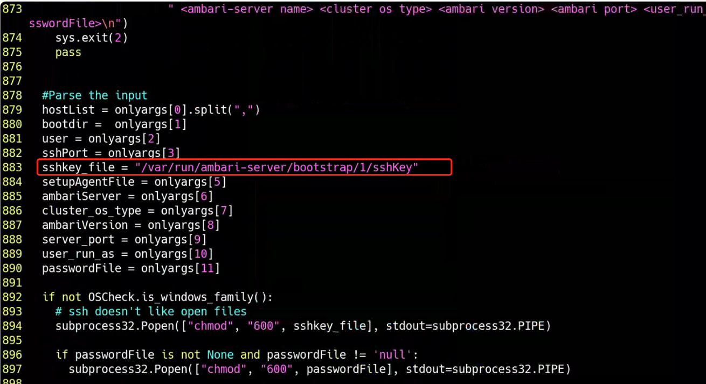


**1.openssl版本问题**

错误如下：ERROR 2018-09-11 14:51:40,101 NetUtil.py:96 - EOF occurred in violation of protocol (_ssl.c:579)

ERROR 2018-09-11 14:51:40,101 NetUtil.py:97 - SSLError: Failed to connect. Please check openssl library versions.

解决方法：

 

vim /etc/python/cert-verification.cfg

\# Possible values are:
\# 'enable' to ensure HTTPS certificate verification is enabled by default
\# 'disable' to ensure HTTPS certificate verification is disabled by default
\# 'platform_default' to delegate the decision to the redistributor providing this particular Python version

\# For more info refer to https://www.python.org/dev/peps/pep-0493/

*[https]
verify=platform_default*

*把\*verify的值改为disable**

在ambari-agent的配置文件/etc/ambari-agent/conf/ambari-agent.ini的[security]加

force_https_protocol=PROTOCOL_TLSv1_2

**2.安装服务时提示namenode不能以home开头（非root用户安装时）**

解决方法：vi /usr/lib/ambari-server/web/javascripts/app.js

isAllowedDir: function(value) {
var dirs = value.replace(/,/g,' ').trim().split(new RegExp("\\s+", "g"));
for(var i = 0; i < dirs.length; i++){
if(dirs[i].startsWith('/home') || dirs[i].startsWith('/homes')) {
return false;
}
}
return true;
}

把false改为true

**3.install时一直失败**

解决方法：vi /usr/lib/ambari-agent/lib/resource_management/libraries/script/script.py

把541行注释掉就可以了

**4.注册节点失败（非root用户安装时）**

解决方法：vi /etc/sudoers在最后加

用户名   ALL=(ALL)    NOPASSWD:ALL

**5.ambari-service启动时一直retrying**

解决方法：给当前用户分配加载mysql驱动包的权限


### 3 Confirm Hosts

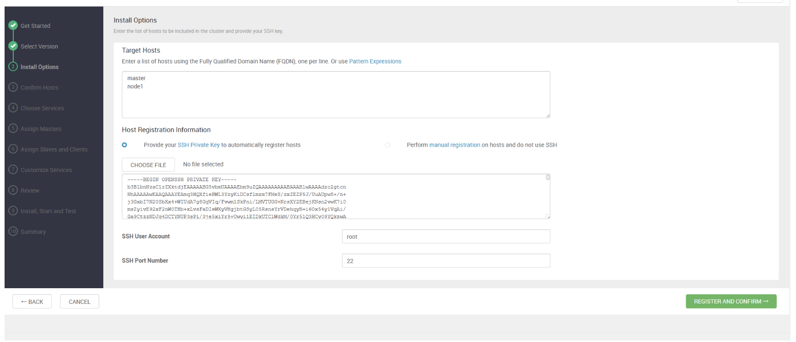

#### Exception


### 4 Choose Service 

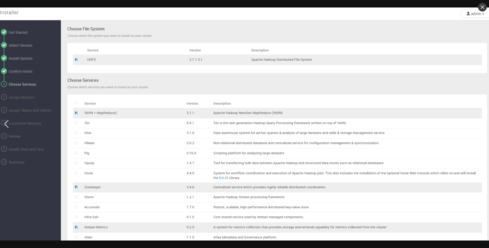


### 5 Assign Masters

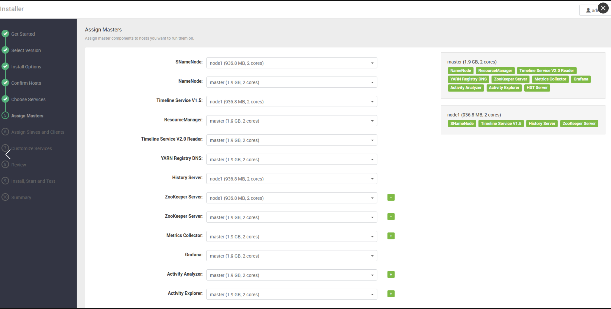

### 6 Assign Slaves and Client

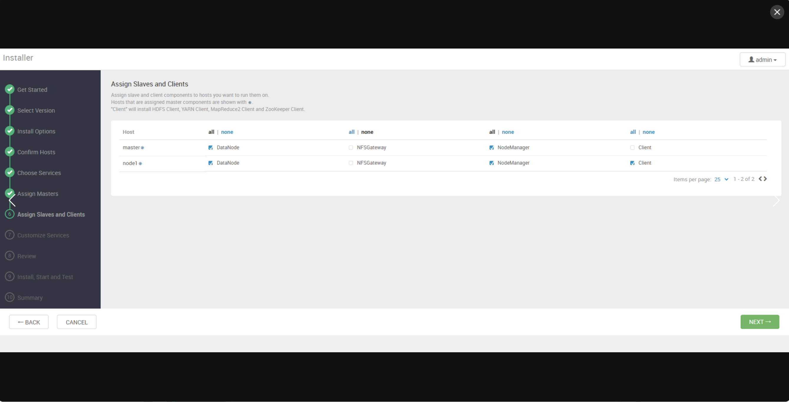

### 7 Customize Services

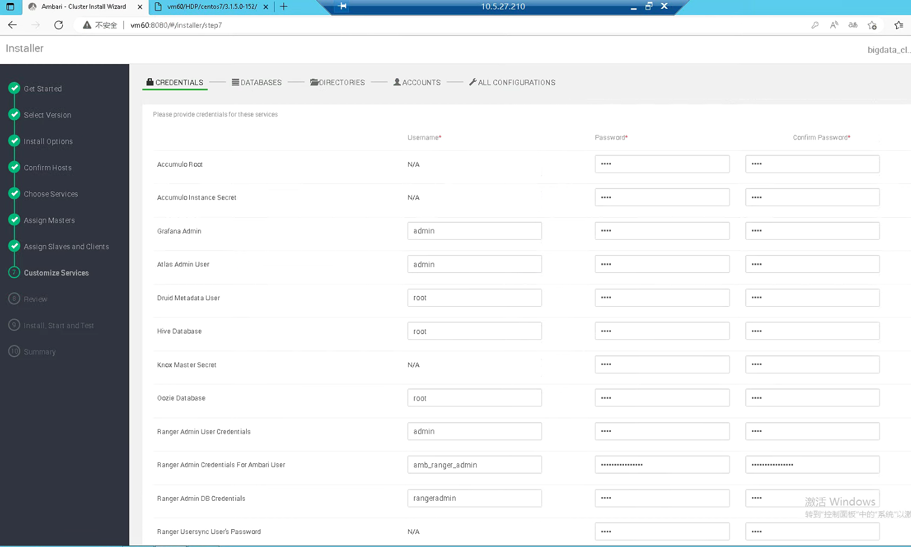


### 8 review

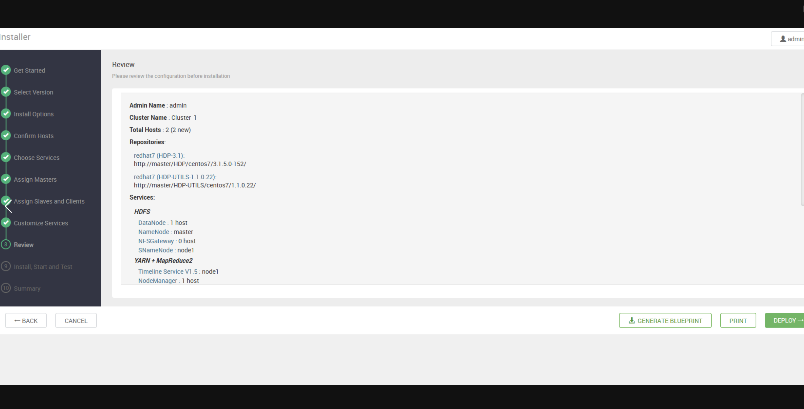


### 9 Install Start and Test


## 七、卸载

### 1、 通过ambari将集群中的所用组件都关闭，如果关闭不了，直接kill-9 XXX

### 2、关闭ambari-server，ambari-agent

```shell
ambari-server stop
ambari-agent stop
```


### 3、yum删除所有Ambari组件

```shell
yum remove hadoop_2* hdp-select* ranger_2* zookeeper* bigtop*atlas-metadata* ambari* spark* slide strom
```

以上命令可能不全，执行完一下命令后，再执行

```shell
rpm –qa|grep Ambari2.7.5.0
```

查看是否还有没有卸载的，如果有，继续通过#yum remove XXX卸载

### 4、删除postgresql的数据

postgresql软件卸载后，其数据还保留在硬盘中，需要把这部分数据删除掉，如果不删除掉，重新安装ambari-server后，有可能还应用以前的安装数据，而这些数据时错误数据，所以需要删除掉。

```shell
 rm -rf /var/lib/pgsql
```


### 5、 删除用户

  ambari安装hadoop集群会创建一些用户，清除集群时有必要清除这些用户，并删除对应的文件夹。这样做可以避免集群运行时出现的文件访问权限错误的问题。

```shell
userdel oozie
userdel hive
userdel ambari-qa
userdel flume 
userdel hdfs 
userdel knox 
userdel storm 
userdel mapred
userdel hbase 
userdel tez 
userdel zookeeper
userdel kafka 
userdel falcon
userdel sqoop 
userdel yarn 
userdel hcat
userdel atlas
userdel spark
 
rm -rf /home/atlas
rm -rf /home/accumulo
rm -rf /home/hbase
rm -rf /home/hive
rm -rf /home/oozie
rm -rf /home/storm
rm -rf /home/yarn
rm -rf /home/ambari-qa
rm -rf /home/falcon
rm -rf /home/hcat
rm -rf /home/kafka
rm -rf /home/mahout
rm -rf /home/spark
rm -rf /home/tez
rm -rf /home/zookeeper
rm -rf /home/flume
rm -rf /home/hdfs
rm -rf /home/knox
rm -rf /home/mapred
rm -rf /home/sqoop
```


### 6、删除ambari遗留数据

```shell
rm -rf /var/lib/ambari*
rm -rf/usr/lib/python2.6/site-packages/ambari_*
rm -rf/usr/lib/python2.6/site-packages/resource_management
rm -rf /usr/lib/ambari-*
rm -rf /etc/ambari-*
```


### 7、删除其他hadoop组件遗留数据

```shell
rm -rf /etc/hadoop
rm -rf /etc/hbase
rm -rf /etc/hive 
rm -rf /etc/oozie
rm -rf /etc/sqoop 
rm -rf /etc/zookeeper
rm -rf /etc/flume 
rm -rf /etc/storm 
rm -rf /etc/hive-hcatalog
rm -rf /etc/tez 
rm -rf /etc/falcon 
rm -rf /etc/knox 
rm -rf /etc/hive-webhcat
rm -rf /etc/kafka 
rm -rf /etc/slider 
rm -rf /etc/storm-slider-client
rm -rf /etc/spark 
rm -rf /var/run/spark
rm -rf /var/run/hadoop
rm -rf /var/run/hbase
rm -rf /var/run/zookeeper
rm -rf /var/run/flume
rm -rf /var/run/storm
rm -rf /var/run/webhcat
rm -rf /var/run/hadoop-yarn
rm -rf /var/run/hadoop-mapreduce
rm -rf /var/run/kafka
rm -rf /var/log/hadoop
rm -rf /var/log/hbase
rm -rf /var/log/flume
rm -rf /var/log/storm
rm -rf /var/log/hadoop-yarn
rm -rf /var/log/hadoop-mapreduce
rm -rf /var/log/knox 
rm -rf /usr/lib/flume
rm -rf /usr/lib/storm
rm -rf /var/lib/hive 
rm -rf /var/lib/oozie
rm -rf /var/lib/flume
rm -rf /var/lib/hadoop-hdfs
rm -rf /var/lib/knox 
rm -rf /var/log/hive 
rm -rf /var/log/oozie
rm -rf /var/log/zookeeper
rm -rf /var/log/falcon
rm -rf /var/log/webhcat
rm -rf /var/log/spark
rm -rf /var/tmp/oozie
rm -rf /tmp/ambari-qa
rm -rf /var/hadoop
rm -rf /hadoop/falcon
rm -rf /tmp/hadoop 
rm -rf /tmp/hadoop-hdfs
rm -rf /usr/hdp
rm -rf /usr/hadoop
rm -rf /opt/hadoop
rm -rf /tmp/hadoop
rm -rf /var/hadoop
rm -rf /hadoop
```


总之，Ambari自己创建的东西全部删完，不然的话重新安装的时候会报各种“找不到文件”的错误。

### 8、清理数据库

​    删除mysql中ambari库

```sql
drop database ambari;
```

### 9、通过以上清理后，重新安装ambari和hadoop集群（包括HDFS，YARN+MapReduce2，Zookeeper，AmbariMetrics，Spark）成功。


ambari安装报如下错误：
安装到review步骤，点击【deploy】按钮：
前端页面报：

```
0 status code received on DELETE method for API: /api/v1/clusters/集群名
```
后台报：
```
[
24 Dec 2023 09:44:07,314  WARN [ambari-client-thread-87] ServletHandler:536 - 
javax.servlet.ServletException: org.eclipse.jetty.io.EofException: early EOF
  at com.sun.jersey.spi.container.servlet.WebComponent.service(WebComponent.java:420)
  at com.sun.jersey.spi.container.servlet.ServletContainer.service(ServletContainer.java:558)
  at com.sun.jersey.spi.container.servlet.ServletContainer.service(ServletContainer.java:733)
  at javax.servlet.http.HttpServlet.service(HttpServlet.java:790)
  at org.eclipse.jetty.servlet.ServletHolder.handle(ServletHolder.java:684)
  at org.eclipse.jetty.servlet.ServletHandler$CachedChain.doFilter(ServletHandler.java:1507)
  at org.springframework.security.web.FilterChainProxy$VirtualFilterChain.doFilter(FilterChainProxy.java:330)
  at org.springframework.security.web.access.intercept.FilterSecurityInterceptor.invoke(FilterSecurityInterceptor.java:118)
  at org.springframework.security.web.access.intercept.FilterSecurityInterceptor.doFilter(FilterSecurityInterceptor.java:84)
  at org.springframework.security.web.FilterChainProxy$VirtualFilterChain.doFilter(FilterChainProxy.java:342)
  at org.apache.ambari.server.security.authorization.AmbariAuthorizationFilter.doFilter(AmbariAuthorizationFilter.java:287)
  at org.springframework.security.web.FilterChainProxy$VirtualFilterChain.doFilter(FilterChainProxy.java:342)
  at org.springframework.security.web.access.ExceptionTranslationFilter.doFilter(ExceptionTranslationFilter.java:113)
  at org.springframework.security.web.FilterChainProxy$VirtualFilterChain.doFilter(FilterChainProxy.java:342)
  at org.springframework.security.web.session.SessionManagementFilter.doFilter(SessionManagementFilter.java:103)
  at org.springframework.security.web.FilterChainProxy$VirtualFilterChain.doFilter(FilterChainProxy.java:342)
  at org.springframework.security.web.authentication.AnonymousAuthenticationFilter.doFilter(AnonymousAuthenticationFilter.java:113)
  at org.springframework.security.web.FilterChainProxy$VirtualFilterChain.doFilter(FilterChainProxy.java:342)
  at org.springframework.security.web.servletapi.SecurityContextHolderAwareRequestFilter.doFilter(SecurityContextHolderAwareRequestFilter.java:54)
  at org.springframework.security.web.FilterChainProxy$VirtualFilterChain.doFilter(FilterChainProxy.java:342)
  at org.springframework.security.web.savedrequest.RequestCacheAwareFilter.doFilter(RequestCacheAwareFilter.java:45)
  at org.springframework.security.web.FilterChainProxy$VirtualFilterChain.doFilter(FilterChainProxy.java:342)
  at org.apache.ambari.server.security.authentication.AmbariDelegatingAuthenticationFilter.doFilter(AmbariDelegatingAuthenticationFilter.java:132)
  at org.springframework.security.web.FilterChainProxy$VirtualFilterChain.doFilter(FilterChainProxy.java:342)
  at org.apache.ambari.server.security.authorization.AmbariUserAuthorizationFilter.doFilter(AmbariUserAuthorizationFilter.java:91)
  at org.springframework.security.web.FilterChainProxy$VirtualFilterChain.doFilter(FilterChainProxy.java:342)
  at org.springframework.security.web.context.SecurityContextPersistenceFilter.doFilter(SecurityContextPersistenceFilter.java:87)
  at org.springframework.security.web.FilterChainProxy$VirtualFilterChain.doFilter(FilterChainProxy.java:342)
  at org.springframework.security.web.FilterChainProxy.doFilterInternal(FilterChainProxy.java:192)
  at org.springframework.security.web.FilterChainProxy.doFilter(FilterChainProxy.java:160)
  at org.springframework.web.filter.DelegatingFilterProxy.invokeDelegate(DelegatingFilterProxy.java:237)
  at org.springframework.web.filter.DelegatingFilterProxy.doFilter(DelegatingFilterProxy.java:167)
  at org.eclipse.jetty.servlet.ServletHandler$CachedChain.doFilter(ServletHandler.java:147
at org.springframework.web.filter.DelegatingFilterProxy.doFilter(DelegatingFilterProxy.java:167)
  at org.eclipse.jetty.servlet.ServletHandler$CachedChain.doFilter(ServletHandler.java:1478)
  at org.apache.ambari.server.api.MethodOverrideFilter.doFilter(MethodOverrideFilter.java:72)
  at org.eclipse.jetty.servlet.ServletHandler$CachedChain.doFilter(ServletHandler.java:1478)
  at org.apache.ambari.server.api.AmbariPersistFilter.doFilter(AmbariPersistFilter.java:47)
  at org.eclipse.jetty.servlet.ServletHandler$CachedChain.doFilter(ServletHandler.java:1478)
  at org.apache.ambari.server.security.AbstractSecurityHeaderFilter.doFilter(AbstractSecurityHeaderFilter.java:125)
  at org.eclipse.jetty.servlet.ServletHandler$CachedChain.doFilter(ServletHandler.java:1478)
  at org.eclipse.jetty.servlets.UserAgentFilter.doFilter(UserAgentFilter.java:82)
  at org.eclipse.jetty.servlets.GzipFilter.doFilter(GzipFilter.java:294)
  at org.eclipse.jetty.servlet.ServletHandler$CachedChain.doFilter(ServletHandler.java:1478)
  at org.eclipse.jetty.servlet.ServletHandler.doHandle(ServletHandler.java:499)
  at org.eclipse.jetty.server.handler.ScopedHandler.handle(ScopedHandler.java:137)
  at org.eclipse.jetty.security.SecurityHandler.handle(SecurityHandler.java:557)
  at org.eclipse.jetty.server.session.SessionHandler.doHandle(SessionHandler.java:231)
  at org.eclipse.jetty.server.handler.ContextHandler.doHandle(ContextHandler.java:1086)
  at org.eclipse.jetty.servlet.ServletHandler.doScope(ServletHandler.java:427)
  at org.eclipse.jetty.server.session.SessionHandler.doScope(SessionHandler.java:193)
  at org.eclipse.jetty.server.handler.ContextHandler.doScope(ContextHandler.java:1020)
  at org.eclipse.jetty.server.handler.ScopedHandler.handle(ScopedHandler.java:135)
  at org.apache.ambari.server.controller.AmbariHandlerList.processHandlers(AmbariHandlerList.java:212)
  at org.apache.ambari.server.controller.AmbariHandlerList.processHandlers(AmbariHandlerList.java:201)
  at org.apache.ambari.server.controller.AmbariHandlerList.handle(AmbariHandlerList.java:139)
  at org.eclipse.jetty.server.handler.HandlerWrapper.handle(HandlerWrapper.java:116)
  at org.eclipse.jetty.server.Server.handle(Server.java:370)
  at org.eclipse.jetty.server.AbstractHttpConnection.handleRequest(AbstractHttpConnection.java:494)
  at org.eclipse.jetty.server.AbstractHttpConnection.content(AbstractHttpConnection.java:984)
  at org.eclipse.jetty.server.AbstractHttpConnection$RequestHandler.content(AbstractHttpConnection.java:1045)
  at org.eclipse.jetty.http.HttpParser.parseNext(HttpParser.java:861)
  at org.eclipse.jetty.http.HttpParser.parseAvailable(HttpParser.java:236)
  at org.eclipse.jetty.server.AsyncHttpConnection.handle(AsyncHttpConnection.java:82)
  at org.eclipse.jetty.io.nio.SelectChannelEndPoint.handle(SelectChannelEndPoint.java:696)
  at org.eclipse.jetty.io.nio.SelectChannelEndPoint$1.run(SelectChannelEndPoint.java:53)
  at org.eclipse.jetty.util.thread.QueuedThreadPool.runJob(QueuedThreadPool.java:608)
  at org.eclipse.jetty.util.thread.QueuedThreadPool$3.run(QueuedThreadPool.java:543)
  at java.lang.Thread.run(Thread.java:748)

```
请问如何解决？


https://issues.apache.org/jira/browse/AMBARI-9776 我参考这个 issue. 修改了 ambari-server 的 3个配置的值为 cpu 的核数： agent.threadpool.size.max=
view.extraction.threadpool.size.max=
client.threadpool.size.max= 

原来这3个值是25，我改成了8


