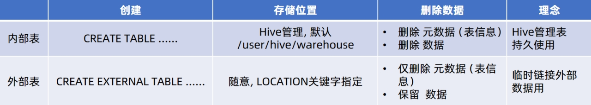

## Basic

### 数仓基本概念

Web为什么需要大数据?

Why does the web need big data?

数据存储有瓶颈

Data storage has bottlenecks

数据计算有瓶颈

Data calculation has bottlenecks

实时场景有瓶颈

Real-time scenarios have bottlenecks

数据挖掘有瓶颈

Data mining has bottlenecks

#### 数据库三范式 Database Three Paradigms

第一范式：原子性，字段不可分 Atomicity, fields are indivisible

第二范式：唯一性，有主键，非主键字段依赖于主键 Uniqueness, with a primary key, non-primary key fields depend on the primary key

第三范式：非主键字段不能相互依赖 Non-primary key fields cannot depend on each other

#### ER实体关系模型

ER:Entity-Relatinship 实体关系模型

#### 为什么构建数据仓库？

#### 数据仓库分层设计 Data warehouse layered design


### HDFS

#### 常用命令

hadoop命令（老版本用法），用法：hadoop fs [generic options]

hdfs命令（新版本用法），用法：hdfs dfs [generic options]

##### 1.创建文件夹

hadoop fs -mkdir [-p] <path> ...

hdfs dfs -mkdir [-p] <path> ...	

path 为待创建的目录	-p选项的行为与Linux mkdir -p一致，它会沿着路径创建父目录。

```shell
hadoop fs -mkdir -p /itcast/bigdata
hdfs fs -mkdir -p /itheima/hadoop
```

##### 2.查看指定目录下内容

hadoop fs -ls [-h] [-R] [<path> ...] 

hdfs dfs -ls [-h] [-R] [<path> ...] 	

path 指定目录路径	

-h 人性化显示文件size	

-R 递归查看指定目录及其子目录

##### 3.上传文件到HDFS指定目录下

hadoop fs -put [-f] [-p] <localsrc> ... <dst>

hdfs dfs -put [-f] [-p] <localsrc> ... <dst>

-f 覆盖目标文件（已存在下）	

-p 保留访问和修改时间，所有权和权限。	

localsrc 本地文件系统（客户端所在机器）	

dst 目标文件系统（HDFS）

##### 4.查看HDFS文件内容

hadoop fs -cat <src> ... 

hdfs dfs -cat <src> ...        

读取指定文件全部内容，显示在标准输出控制台。

```shell
hadoop fs -cat /itcast/words.txt
hdfs dfs -cat /itcast/profile
```

读取大文件可以使用管道符配合more

hadoop fs -cat <src> | more

hdfs dfs -cat <src> | more

##### 5.下载HDFS文件

hadoop fs -get [-f] [-p] <src> ... <localdst>

hdfs dfs -get [-f] [-p] <src> ... <localdst>        

下载文件到本地文件系统指定目录，localdst必须是目录        -f 覆盖目标文件（已存在下）        -p 保留访问和修改时间，所有权和权限。

```shel
mkdir test
cd test/
ll
total 0
hadoop fs -get /itcast/zookeeper.out ./
ll
total 20
-rw-r--r-- 1 root root 18213 Aug 18 17:54 zookeeper.out
```

##### 6.拷贝HDFS文件

hadoop fs -cp [-f] <src> ... <dst> 

hdfs dfs -cp [-f] <src> ... <dst>        

-f 覆盖目标文件（已存在下）

##### 7.追加数据到HDFS文件中

hadoop fs -appendToFile <localsrc> ... <dst>

hdfs dfs -appendToFile <localsrc> ... <dst>       

 将所有给定本地文件的内容追加到给定dst文件。         dst如果文件不存在，将创建该文件。         如果<localSrc>为-，则输入为从标准输入中读取。

##### 8.HDFS数据移动操作

hadoop fs -mv <src> ... <dst>

hdfs dfs -mv <src> ... <dst>	        

移动文件到指定文件夹下        

可以使用该命令移动数据，重命名文件的名称

##### 9.HDFS数据删除操作

hadoop fs -rm -r [-skipTrash] URI [URI ...]

hdfs dfs -rm -r [-skipTrash] URI [URI ...]	       

 删除指定路径的文件或文件夹        -skipTrash 跳过回收站，直接删除

回收站功能默认关闭，如果要开启需要在core-site.xml内配置：

```xm
<property>
<name>fs.trash.interval</name>
<value>1440</value>
</property>
 
<property>
<name>fs.trash.checkpoint.interval</name>
<value>120</value>
</property>

```

无需重启集群，在哪个机器配置的，在哪个机器执行命令就生效。回收站默认位置在：/user/用户名(hadoop)/.Trash

##### 10.HDFS shell其它命令

命令官方指导文档

https://hadoop.apache.org/docs/r3.3.4/hadoop-project-dist/hadoop-common/FileSystemShell.html

#### HDFS权限

HDFS (Hadoop Distributed File System) permissions are based on a model similar to traditional Unix permissions, including users, groups, and permission bits. Here’s a breakdown of the key aspects of HDFS permissions:

##### 1. **Basic Permissions Model**

HDFS permissions are defined for three entities:

- **Owner**: The user who owns the file/directory.
- **Group**: The group that owns the file/directory.
- **Others**: Everyone else.

Each file or directory in HDFS has **three types of permissions** for each of the above entities:

- **Read (r)**: Permission to read the file or list the contents of a directory.
- **Write (w)**: Permission to modify or delete a file, or create or delete files within a directory.
- **Execute (x)**: Permission to execute a file or access the directory (traverse the directory tree).

These permissions are displayed in three triplets, like in Unix:

```bash
-rwxr-xr--
```

The first triplet represents the owner’s permissions, the second the group’s, and the third represents others' permissions.

##### 2. **Superuser (Root/Administrator)**

In HDFS, a superuser (usually `hdfs` or `root`) has special privileges and can override file permissions. The superuser has unrestricted access to all files and directories, regardless of their permissions. This is useful for administrative tasks like managing files across users.

##### 3. **Changing Ownership and Permissions**

- **`chown` command**: Changes the ownership of a file or directory.

```ba
hdfs dfs -chown [owner]:[group] /path/to/file
```

- **`chmod` command**: Changes the permissions of a file or directory.

```bash
hdfs dfs -chmod 755 /path/to/file
```

- **`chgrp` command**: Changes the group ownership.

```bash
hdfs dfs -chgrp [group] /path/to/file
```

##### 4. **ACLs (Access Control Lists)** 访问控制列表

In addition to standard Unix-style permissions, HDFS also supports **ACLs**. ACLs allow more granular control over file permissions by providing the ability to set permissions for specific users and groups beyond just the owner, group, and others.

- Add ACL entries

  ```bash
  hdfs dfs -setfacl -m user:username:rwx /path/to/file
  ```

- Remove ACL entries

  ```bash
  hdfs dfs -setfacl -x user:username /path/to/file
  ```

- View ACLs

  ```bash
  hdfs dfs -getfacl /path/to/file
  ```

##### 5. **Permission Inheritance** 权限继承

In HDFS, unlike traditional Unix, directories do not automatically inherit the permissions of their parent directory. You need to explicitly set the correct permissions for each new file or directory created under a parent directory.

##### 6. **Special Considerations**

- **Sticky Bit**: HDFS also supports the sticky bit, which restricts the deletion or renaming of files in a directory to the file's owner or the directory’s owner, even if others have write access.

  ```bash
  hdfs dfs -chmod +t /path/to/directory
  ```

- **`umask`**: When a file or directory is created, the default permissions are determined by the **umask** setting, which subtracts permissions from the maximum possible settings.

###### Example

Consider a file with the following HDFS permissions:

```bash
-rw-r--r--   3 hdfs supergroup  1048576 2024-09-04  /user/hadoop/file.txt
```

- **`rw-` (owner)**: The owner (`hdfs`) has read and write permissions.
- **`r--` (group)**: The group (`supergroup`) has read-only permissions.
- **`r--` (others)**: Everyone else has read-only permissions.

##### 7. **Best Practices**

- Use **groups** to manage permissions across users.
- Apply **ACLs** for complex permission setups that cannot be handled by standard Unix permissions.
- Use the **sticky bit** to protect important directories from accidental deletions.

##### Reference

For more detailed information, you can visit the official [Apache Hadoop HDFS Permissions Guide](https://hadoop.apache.org/docs/current/hadoop-project-dist/hadoop-hdfs/HdfsPermissionsGuide.html).

#### HDFS客户端 - Jetbrians产品插件

在Jetbrains的产品中，均可以安装插件，其中：Big Data Tools插件可以帮助我们方便的操作HDFS，比如

- IntelliJ IDEA（Java IDE）

- PyCharm（Python IDE）

- DataGrip（SQL IDE）

  均可以支持Bigdata Tool插件。

如图，在设置->Plugins（插件）-> Marketplace（市场），搜索Big Data Tools，点击Install安装即可

##### 配置Windows

需要对Windows系统做一些基础设置，配合插件使用

- 解压Hadoop安装包到Windows系统，如解压到：E:\hadoop-3.3.4

- 设置\$HADOOP_HOME环境变量指向：E:\hadoop-3.3.4

- 下载

  - hadoop.dll（https://github.com/steveloughran/winutils/blob/master/hadoop-3.0.0/bin/hadoop.dll）

  - winutils.exe（https://github.com/steveloughran/winutils/blob/master/hadoop-3.0.0/bin/winutils.exe）

  - 可以自行下载，或从课程资料中获取

    将hadoop.dll和winutils.exe放入$HADOOP_HOME/bin中

#### HDFS客户端 - NFS

##### 1.使用NFS网关功能将HDFS挂载到本地系统

HDFS提供了基于NFS（Network File System）的插件，可以对外提供NFS网关，供其它系统挂载使用。NFS 网关支持 NFSv3，并允许将 HDFS 作为客户机本地文件系统的一部分挂载，现在支持：上传、下载、删除、追加内容如下图，将HDFS挂载为Windows文件管理器的网络位置


配置HDFS需要配置如下内容：

core-site.xml，新增配置项 以及 hdfs-site.xml，新增配置项

开启portmap、nfs3两个新进程在node1进行如下操作

1. 在core-site.xml 内新增如下两项

```xml
  <property>
    <name>hadoop.proxyuser.hadoop.groups</name>
    <value>*</value>
  </property>

  <property>
    <name>hadoop.proxyuser.hadoop.hosts</name>
    <value>*</value>
  </property>
```

- 项目： hadoop.proxyuser.hadoop.groups 值：*允许hadoop用户代理任何其它用户组*

- 项目：hadoop.proxyuser.hadoop.hosts 值：*允许代理任意服务器的请求

2. 在hdfs-site.xml中新增如下项

```xml
<property>
    <name>nfs.superuser</name>
    <value>hadoop</value>
  </property>
  <property>
    <name>nfs.dump.dir</name>
    <value>/tmp/.hdfs-nfs</value>
  </property>
  <property>
    <name>nfs.exports.allowed.hosts</name>
    <value>192.168.88.1 rw</value>
  </property>
```

- nfs.suerpser：NFS操作HDFS系统，所使用的超级用户（hdfs的启动用户为超级用户）
- nfs.dump.dir：NFS接收数据上传时使用的临时目录

- nfs.exports.allowed.hosts：NFS允许连接的客户端IP和权限，rw表示读写，IP整体或部分可以以*代替

设置的允许192.168.88.1以rw连接（这个IP是电脑虚拟网卡VMnet8的IP，连接虚拟机就走这个网卡）

启动NFS功能

1. 将配置好的core-site.xml和hdfs-site.xml分发到node2和node3
2. 重启Hadoop HDFS集群（先stop-dfs.sh，后start-dfs.sh）
3.  停止系统的NFS相关进程a. systemctl stop nfs; systemctl disable nfs     关闭系统nfs并关闭其开机自启b. yum remove -y rpcbind    卸载系统自带rpcbind
4. 启动portmap（HDFS自带的rpcbind功能）（必须以root执行）：hdfs --daemon start portmap
5. 启动nfs（HDFS自带的nfs功能）（必须以hadoop用户执行）：hdfs --daemon start nfs3

#### HDFS原理

##### HDFS数据的读写流程

###### 数据写入流程


- 1.客户端向NameNode发起请求
- 2. NameNode审核权限、剩余空间后，满足条件允许写入，并告知客户端写入的DataNode地址
  2.  客户端向指定的DataNode发送数据包
  2. 被写入数据的DataNode同时完成数据副本的复制工作，将其接收的数据分发给其它DataNode
  2. 如上图，DataNode1复制给DataNode2，然后基于DataNode2复制给Datanode3和DataNode4
  2. 写入完成客户端通知NameNode，NameNode做元数据记录工作


关键信息点：

- NameNode不负责数据写入，只负责元数据记录和权限审批

- 客户端直接向1台DataNode写数据，这个DataNode一般是离客户端最近（网络距离）的那一个

- 数据块副本的复制工作，由DataNode之间自行完成（构建一个PipLine，按顺序复制分发，如图1给2, 2给3和4）

###### 数据读取流程


1、客户端向NameNode申请读取某文件

2、 NameNode判断客户端权限等细节后，允许读取，并返回此文件的block列表

3、客户端拿到block列表后自行寻找DataNode读取即可

关键点：

1、数据同样不通过NameNode提供

2、NameNode提供的block列表，会基于网络距离计算尽量提供离客户端最近的

这是因为1个block有3份，会尽量找离客户端最近的那一份让其读取

### MapReduce

1.什么是计算、分布式计算？

- 计算：对数据进行处理，使用统计分析等手段得到需要的结果

- 分布式计算：多台服务器协同工作，共同完成一个计算任务

2. 分布式计算常见的2种工作模式：
   - 分散->汇总  （MapReduce就是这种模式）
   - 中心调度->步骤执行 （大数据体系的Spark、Flink等是这种模式）

#### MapReduce概述

MapReduce是“分散->汇总”模式的分布式计算框架，可供开发人员开发相关程序进行分布式数据计算。MapReduce提供了2个编程接口：

- Map

- Reduce

其中

- Map功能接口提供了“分散”的功能， 由服务器分布式对数据进行处理

- Reduce功能接口提供了“汇总（聚合）”的功能，将分布式的处理结果汇总统计

用户如需使用MapReduce框架完成自定义需求的程序开发只需要使用Java、Python等编程语言，实现Map Reduce功能接口即可。

#### yarn概述

1. YARN是做什么的？

   YARN是Hadoop的一个组件用以做集群的资源（内存、CPU等）调度

2. 为什么需要资源调度

   将资源统一管控进行分配可以提高资源利用率

3.  程序如何在YARN内运行程序

   - 向YARN申请所需资源

   - YARN为程序分配所需资源供程序使用

4. MapReduce和YARN的关系

   YARN用来调度资源给MapReduce分配和管理运行资源

   所以，MapReduce需要YARN才能执行（普遍情况）

YARN的架构有哪些角色

- 核心角色：ResourceManager和NodeManager

- 辅助角色：ProxyServer，保障WEB UI访问的安全性

- 辅助角色：JobHistoryServer，记录历史程序运行信息和日志

### Hive

#### Hive概述

1. 什么是分布式SQL计算？

   以分布式的形式，执行SQL语句，进行数据统计分析。

   2. Apache Hive是做什么的？

      很简单，将SQL语句翻译成MapReduce程序，从而提供用户分布式SQL计算的能力。

      - 传统MapReduce开发：写MR代码->得到结果

      - 使用Hive开发：写SQL->得到结果

      - 底层都是MR在运行，但是使用层面上更加简单了。

#### Hive架构

Apache Hive其2大主要组件就是：SQL解析器以及元数据存储， 如下图。


#### hive操作

##### 数据库操作

###### 创建数据库

```sql
create database if not exists myhive;
use  myhive;
```

###### 查看数据库详细信息

```sql
desc  database  myhive;
```

数据库本质上就是在HDFS之上的文件夹。

默认数据库的存放路径是HDFS的：/user/hive/warehouse内

创建数据库并指定hdfs存储位置

create database myhive2 location '/myhive2';

使用location关键字，可以指定数据库在HDFS的存储路径。

删除一个空数据库，如果数据库下面有数据表，那么就会报错

drop  database  myhive;

强制删除数据库，包含数据库下面的表一起删除

drop  database  myhive2  cascade; 

1.创建库的语法为

CREATE DATABASE [IF NOT EXISTS] db_name [LOCATION position];

2.删除库的语法为

DROP DATABASE db_name [CASCADE];

3.数据库和HDFS的关系

- Hive的库在HDFS上就是一个以.db结尾的目录

- 默认存储在：/user/hive/warehouse内

- 可以通过LOCATION关键字在创建的时候指定存储目录

##### 数据表操作

###### 创建数据表的语法


EXTERNAL，创建外部表

PARTITIONED BY， 分区表

CLUSTERED BY，分桶表

STORED AS，存储格式

LOCATION，存储位置

###### 数据类型

| **分类** | **类型**  | **描述**                                       | **字面量示例**                                               |
| -------- | --------- | ---------------------------------------------- | ------------------------------------------------------------ |
| 原始类型 | BOOLEAN   | true/false                                     | TRUE                                                         |
|          | TINYINT   | 1字节的有符号整数 -128~127                     | 1Y                                                           |
|          | SMALLINT  | 2个字节的有符号整数，-32768~32767              | 1S                                                           |
|          | INT       | 4个字节的带符号整数                            | 1                                                            |
|          | BIGINT    | 8字节带符号整数                                | 1L                                                           |
|          | FLOAT     | 4字节单精度浮点数1.0                           |                                                              |
|          | DOUBLE    | 8字节双精度浮点数                              | 1.0                                                          |
|          | DEICIMAL  | 任意精度的带符号小数                           | 1.0                                                          |
|          | STRING    | 字符串，变长                                   | “a”,’b’                                                      |
|          | VARCHAR   | 变长字符串                                     | “a”,’b’                                                      |
|          | CHAR      | 固定长度字符串                                 | “a”,’b’                                                      |
|          | BINARY    | 字节数组                                       |                                                              |
|          | TIMESTAMP | 时间戳，毫秒值精度                             | 122327493795                                                 |
|          | DATE      | 日期                                           | ‘2016-03-29’                                                 |
|          |           | 时间频率间隔                                   |                                                              |
| 复杂类型 | ARRAY     | 有序的的同类型的集合                           | array(1,2)                                                   |
|          | MAP       | key-value,key必须为原始类型，value可以任意类型 | map(‘a’,1,’b’,2)                                             |
|          | STRUCT    | 字段集合,类型可以不同                          | struct(‘1’,1,1.0), named_stract(‘col1’,’1’,’col2’,1,’clo3’,1.0) |
|          | UNION     | 在有限取值范围内的一个值                       | create_union(1,’a’,63)                                       |


##### 内部表和外部表

内部表（CREATE TABLE table_name ......）

未被external关键字修饰的即是内部表， 即普通表。 内部表又称管理表,内部表数据存储的位置由hive.metastore.warehouse.dir参数决定（默认：/user/hive/warehouse），删除内部表会直接删除元数据（metadata）及存储数据，因此内部表不适合和其他工具共享数据。

外部表（CREATE EXTERNAL TABLE table_name ......LOCATION......）

被external关键字修饰的即是外部表， 即关联表。

外部表是指表数据可以在任何位置，通过LOCATION关键字指定。 数据存储的不同也代表了这个表在理念是并不是Hive内部管理的，而是可以随意临时链接到外部数据上的。所以，在删除外部表的时候， 仅仅是删除元数据（表的信息），不会删除数据本身。

快速对比一下内部表和外部表

| ** **  | **创建**                     | **存储位置**                       | **删除数据**                     | **理念**           |
| ------ | ---------------------------- | ---------------------------------- | -------------------------------- | ------------------ |
| 内部表 | CREATE TABLE ......          | Hive管理，默认/user/hive/warehouse | 删除 元数据（表信息）删除 数据   | Hive管理表持久使用 |
| 外部表 | CREATE EXTERNAL TABLE ...... | 随意，LOCATION关键字指定           | 仅删除 元数据（表信息）保留 数据 | 临时链接外部数据用 |

###### 创建内部表

创建一个基础的表

```sql
create database if not exists myhive;
use myhive;
create table if not exists stu(id int,name string);
insert into stu values (1,"zhangsan"), (2, "wangwu");
select * from stu;
```

###### 数据分隔符

默认的数据分隔符是：”\001”是一种特殊字符，是ASCII值，键盘是打不出来在某些文本编辑器中是显示为SOH的。

###### 自行指定分隔符

当然，分隔符我们是可以自行指定的。在创建表的时候可以自己决定：

```sql
create table if not exists stu2(id int ,name string) row format delimited fields terminated by '\t';
```

###### 其它创建内部表的形式

CREATE TABLE table_name as，基于查询结果建表

```sql
create table stu3 as select * from stu2;
```

CREATE TABLE table_name like，基于已存在的表结构建表

```sql
create table stu4 like stu2;
```

也可以使用DESC FORMATTED table_name，查看表类型和详情

```sql
DESC FORMATTED stu2;
```

###### 删除内部表

DROP TABLE table_name，删除表

```sql
drop table stu2;
```

###### 外部表的创建



外部表，创建表被EXTERNAL关键字修饰，从概念是被认为并非Hive拥有的表，只是临时关联数据去使用。

创建外部表也很简单，基于外部表的特性，可以总结出： 外部表 和 数据 是相互独立的， 即：

可以先有表，然后把数据移动到表指定的LOCATION中

也可以先有数据，然后创建表通过LOCATION指向数据

###### 内外部表转换

内部表转外部表

alter table stu set tblproperties('EXTERNAL'='TRUE');

外部表转内部表

alter table stu set tblproperties('EXTERNAL'='FALSE');

要注意：('EXTERNAL'='FALSE') 或 ('EXTERNAL'='TRUE')为固定写法，区分大小写！！！

##### 数据加载与导出

###### 数据加载 - LOAD语法


###### 数据加载 - INSERT SELECT 语法

除了load加载外部数据外，我们也可以通过SQL语句，从其它表中加载数据。语法：

INSERT [OVERWRITE | INTO] TABLE tablename1 [PARTITION (partcol1=val1, partcol2=val2 ...) [IF NOT EXISTS]] select_statement1 FROM from_statement;将SELECT查询语句的结果插入到其它表中，被SELECT查询的表可以是内部表或外部表。示例：

```sql
INSERT INTO TABLE tbl1 SELECT * FROM tbl2;
INSERT OVERWRITE TABLE tbl1 SELECT * FROM tbl2;
```


##### 数据加载-两种选择

对于数据加载，我们学习了：

LOAD和INSERT SELECT的方式，那么如何选择它们使用呢？

- 数据在本地

推荐 load data local加载

- 数据在HDFS

如果不保留原始文件：	推荐使用LOAD方式直接加载   如果保留原始文件：	推荐使用外部表先关联数据，然后通过INSERT SELECT 外部表的形式加载数据

- 数据已经在表中

只可以INSERT SELECT


