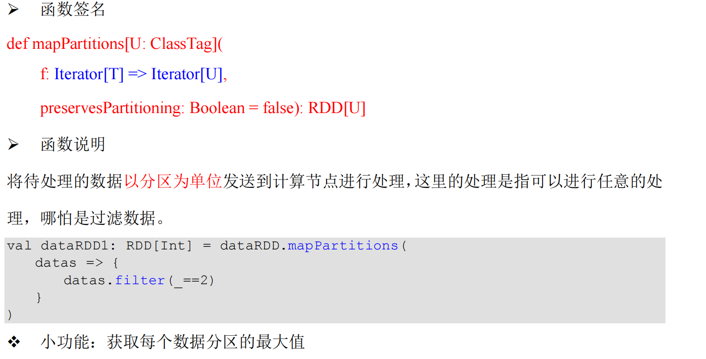
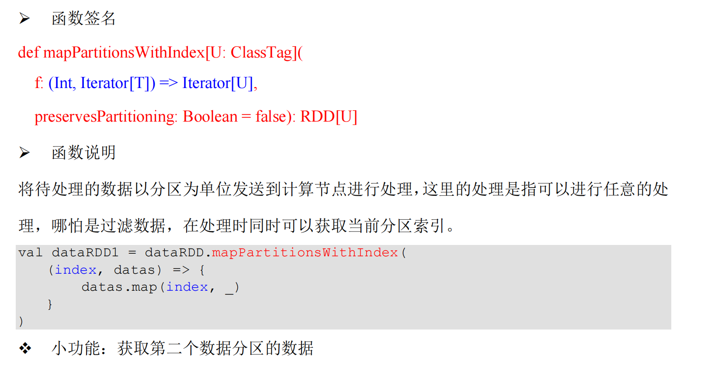
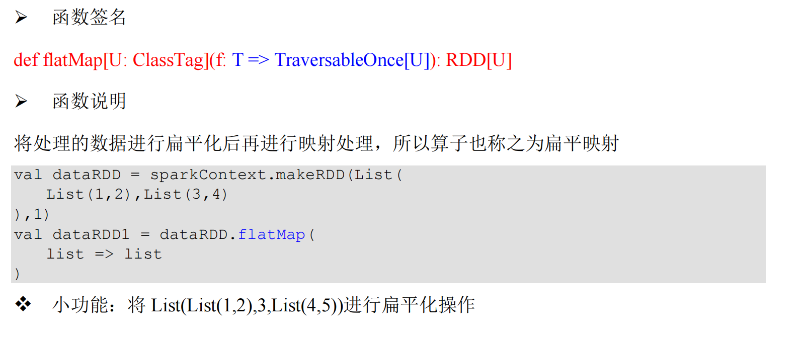
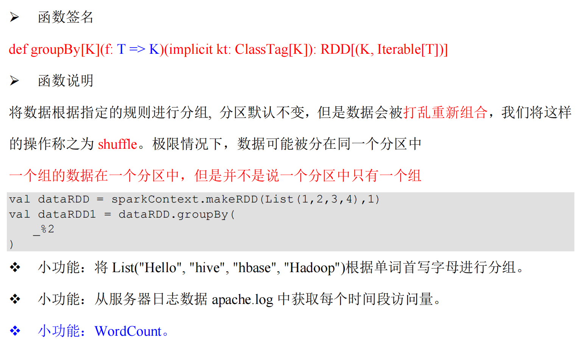
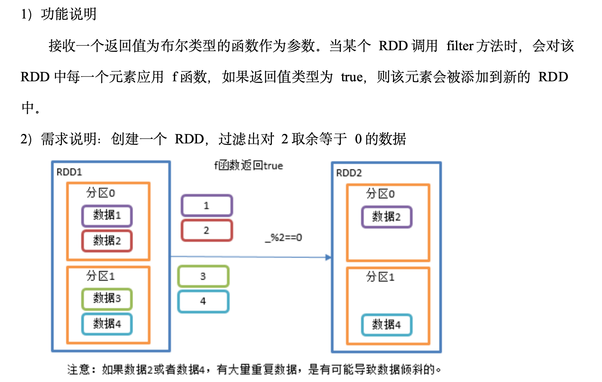

## RDD

### RDD创建

#### 从集合（内存）中创建

从集合中创建 RDD，Spark 主要提供了两个方法：parallelize 和 makeRDD

```scal
import org.apache.spark.{SparkConf, SparkContext}

object CreateRDDFromCollection {
  def main(args: Array[String]): Unit = {
    val sparkConf = new SparkConf().setMaster("local[*]").setAppName("create RDD from collection")
    val sparkContext = new SparkContext(sparkConf)
    val rdd1 = sparkContext.parallelize(List(1, 2, 3, 4))
    val rdd2 = sparkContext.makeRDD(List(1, 2, 3, 4, 5))
    rdd1.collect().foreach(println)
    rdd2.collect().foreach(println)
    sparkContext.stop()
  }
}

```

```java

import org.apache.spark.SparkConf;
import org.apache.spark.api.java.JavaRDD;
import org.apache.spark.api.java.JavaSparkContext;

import java.util.ArrayList;
import java.util.Arrays;
import java.util.List;

public class CreateRDDFromCollectionJava {
    public static void main(String[] args) {
        SparkConf sparkConf = new SparkConf().setMaster("local[*]").setAppName("create RDD from collection");
        JavaSparkContext sparkContext = new JavaSparkContext(sparkConf);
        JavaRDD<Integer> rdd1 = sparkContext.parallelize(Arrays.asList(1,2,3,4,5),2);
        List<Integer> collect = rdd1.collect();
        for (Integer str : collect){
            System.out.println(str);
        }

        sparkContext.stop();
    }
}

```

从底层代码实现来讲，makeRDD 方法其实就是 parallelize 方法

```scal
def makeRDD[T: ClassTag](
 seq: Seq[T],
 numSlices: Int = defaultParallelism): RDD[T] = withScope {
 parallelize(seq, numSlices)
}
```

#### 从外部存储系统的数据集创建

由外部存储系统的数据集创建RDD包括：本地的文件系统，还有所有Hadoop支持的数据集，比如HDFS、HBase等

```sc
import org.apache.spark.{SparkConf, SparkContext}

object CreateRDDFromFiles {
  def main(args: Array[String]): Unit = {
    val sparkConf = new SparkConf().setMaster("local[*]").setAppName("create RDD from files")
    val sc = new SparkContext(sparkConf)
    val fileRDD = sc.textFile("datas/wordcount/")
    val wordRdd = fileRDD.flatMap(_.split(" "))
    wordRdd.collect().foreach(println)
    sc.stop()
  }
}
```

```java
import org.apache.spark.SparkConf;
import org.apache.spark.api.java.JavaRDD;
import org.apache.spark.api.java.JavaSparkContext;

import java.util.Arrays;

public class CreateRDDFromFilesJava {
    public static void main(String[] args) {
        SparkConf sparkConf = new SparkConf().setAppName("create RDD from files").setMaster("local[*]");
        JavaSparkContext javaSparkContext = new JavaSparkContext(sparkConf);
        JavaRDD<String> lineJavaRDD = javaSparkContext.textFile("datas/wordcount/");
        JavaRDD<String> wordJavaRDD = lineJavaRDD.flatMap(line -> Arrays.asList(line.split(" ")).iterator());
        wordJavaRDD.collect().forEach(System.out::println);
    }
}
```


### **RDD** 并行度与分区

默认情况下，Spark 可以将一个作业切分多个任务后，发送给 Executor 节点并行计算，而能够并行计算的任务数量我们称之为并行度。这个数量可以在构建 RDD 时指定。记住，这里的并行执行的任务数量，并不是指的切分任务的数量，不要混淆了。

```scala
val sparkConf =
 new SparkConf().setMaster("local[*]").setAppName("spark")
val sparkContext = new SparkContext(sparkConf)
val dataRDD: RDD[Int] =
 sparkContext.makeRDD(
 List(1,2,3,4),
 4)
val fileRDD: RDD[String] =
 sparkContext.textFile(
 "input",
 2)
fileRDD.collect().foreach(println)
sparkContext.stop()
```

读取内存数据时，数据可以按照并行度的设定进行数据的分区操作，数据分区规则的Spark 核心源码如下：

```scala
def positions(length: Long, numSlices: Int): Iterator[(Int, Int)] = {
 (0 until numSlices).iterator.map { i =>
 val start = ((i * length) / numSlices).toInt
 val end = (((i + 1) * length) / numSlices).toInt
 (start, end)
 }
}
```

读取文件数据时，数据是按照 Hadoop 文件读取的规则进行切片分区，而切片规则和数据读取的规则有些差异，具体 Spark 核心源码如下

```java
public InputSplit[] getSplits(JobConf job, int numSplits)
 throws IOException {
 long totalSize = 0; // compute total size
 for (FileStatus file: files) { // check we have valid files
 if (file.isDirectory()) {
 throw new IOException("Not a file: "+ file.getPath());
 }
 totalSize += file.getLen();
 }
 long goalSize = totalSize / (numSplits == 0 ? 1 : numSplits);
 long minSize = Math.max(job.getLong(org.apache.hadoop.mapreduce.lib.input.
 FileInputFormat.SPLIT_MINSIZE, 1), minSplitSize);
 
 ...
 
 for (FileStatus file: files) {
 
 ...
 
 if (isSplitable(fs, path)) {
 long blockSize = file.getBlockSize();
 long splitSize = computeSplitSize(goalSize, minSize, blockSize);
 ...
 }
 protected long computeSplitSize(long goalSize, long minSize,
 long blockSize) {
 return Math.max(minSize, Math.min(goalSize, blockSize));
 }
```


### **RDD** **转换算子**

RDD 根据数据处理方式的不同将算子整体上分为 Value 类型、双 Value 类型和 Key-Value

#### map

函数签名

def map[U: ClassTag](f: T => U): RDD[U]

将处理的数据逐条进行映射转换，这里的转换可以是类型的转换，也可以是值的转换

```scala
import org.apache.spark.{SparkConf, SparkContext}

object Spark01_RDD_Operator_Transform {
  def main(args: Array[String]): Unit = {
    val sparkConf = new SparkConf().setMaster("local[*]").setAppName("create RDD from files")
    val sc = new SparkContext(sparkConf)
    val rdd = sc.makeRDD(List(1, 2, 3, 4, 5, 6))
    // val rdd2 = rdd.map(num => num * 2 )
    val rdd2 = rdd.map(_ * 2 )
    rdd2.collect().foreach(println)
    sc.stop()
  }

}
```


```java
import org.apache.spark.SparkConf;
import org.apache.spark.api.java.JavaRDD;
import org.apache.spark.api.java.JavaSparkContext;

import java.util.Arrays;

public class Spark01RDDOperatorTransform {
    public static void main(String[] args) {
        SparkConf sparkConf = new SparkConf().setMaster("local[*]").setAppName("Spark01RDDOperatorTransform");
        JavaSparkContext sc = new JavaSparkContext(sparkConf);
        JavaRDD<Integer> parallelize = sc.parallelize(Arrays.asList(1, 2, 3, 4, 5));
        JavaRDD<Integer> mappedRDD = parallelize.map(num -> num * 2);
        mappedRDD.collect().forEach(System.out::println);
        sc.stop();
    }
}

```

#### **mapPartitions**



map 和 mapPartitions 的区别？

➢ 数据处理角度

Map 算子是分区内一个数据一个数据的执行，类似于串行操作。而 mapPartitions 算子是以分区为单位进行批处理操作。

➢ 功能的角度

Map 算子主要目的将数据源中的数据进行转换和改变。但是不会减少或增多数据。

MapPartitions 算子需要传递一个迭代器，返回一个迭代器，没有要求的元素的个数保持不变，所以可以增加或减少数据

➢ 性能的角度

Map 算子因为类似于串行操作，所以性能比较低，而是 mapPartitions 算子类似于批处理，所以性能较高。但是 mapPartitions 算子会长时间占用内存，那么这样会导致内存可能不够用，出现内存溢出的错误。所以在内存有限的情况下，不推荐使用。使用 map 操作。

```scala
import org.apache.spark.{SparkConf, SparkContext}

object Spark02_RDD_Operator_Transform {
  def main(args: Array[String]): Unit = {
    val sparkConf = new SparkConf().setMaster("local[*]").setAppName("create RDD from files")
    val sc = new SparkContext(sparkConf)
    val rdd = sc.makeRDD(List(1, 2, 3, 4, 5, 6),2)

    val mapPartitions = rdd.mapPartitions(
      iter => {
        iter.map(_ * 2)
      }
    )
    mapPartitions.collect().foreach(println)
  }

}
```

```java
import org.apache.spark.SparkConf;
import org.apache.spark.api.java.JavaRDD;
import org.apache.spark.api.java.JavaSparkContext;
import org.apache.spark.api.java.function.FlatMapFunction;

import java.util.ArrayList;
import java.util.Arrays;
import java.util.Iterator;
import java.util.List;
import java.util.function.Consumer;

public class Spark02RDDOperatorTransform {
    public static void main(String[] args) {
        SparkConf sparkConf = new SparkConf().setMaster("local[*]").setAppName("Spark01 RDD Operator Transform");
        JavaSparkContext sc = new JavaSparkContext(sparkConf);
        JavaRDD<Integer> parallelize = sc.parallelize(Arrays.asList(1, 2, 3, 4, 5),2);
        JavaRDD<Integer> integerJavaRDD = parallelize.mapPartitions(
                new FlatMapFunction<Iterator<Integer>, Integer>() {
                    @Override
                    public Iterator<Integer> call(Iterator<Integer> iter) {
                        List<Integer> result = new ArrayList<>();
                        iter.forEachRemaining(a->result.add(a*2));
                        return result.iterator();
                    }
                }
        );
        integerJavaRDD.collect().forEach(System.out::println);
        sc.stop();
    }
}
```


#### mapPartitionsWithIndex



```scala

import org.apache.spark.{SparkConf, SparkContext}

object Spark04_RDD_Operator_Transform {
  def main(args: Array[String]): Unit = {
    val sparkConf = new SparkConf().setMaster("local[*]").setAppName("create RDD from files")
    val sc = new SparkContext(sparkConf)
    val rdd = sc.makeRDD(List(1, 2, 3, 4, 5, 6),2)
    val rdd1 = rdd.mapPartitionsWithIndex(
      (index, iter) => {
        if (index == 1) {
          List(iter.max).iterator
        } else {
          Nil.iterator
        }
      }
    )

    rdd1.collect().foreach(println)
  }

}
```


```java
import org.apache.spark.SparkConf;
import org.apache.spark.api.java.JavaRDD;
import org.apache.spark.api.java.JavaSparkContext;
import org.apache.spark.api.java.function.Function2;
import java.util.ArrayList;
import java.util.Arrays;
import java.util.Iterator;
import java.util.function.Consumer;

public class Spark04RDDOperatorTransform {
    public static void main(String[] args) {
        SparkConf sparkConf = new SparkConf().setMaster("local[*]").setAppName("Spark01 RDD Operator Transform");
        JavaSparkContext sc = new JavaSparkContext(sparkConf);
        JavaRDD<Integer> parallelize = sc.parallelize(Arrays.asList(1, 2, 3, 4, 5,6), 2);
        JavaRDD<Integer> integerJavaRDD = parallelize.mapPartitionsWithIndex(new Function2<Integer, Iterator<Integer>, Iterator<Integer>>() {
            Integer a = 0;
            @Override
            public Iterator<Integer> call(Integer index, Iterator<Integer> integerIterator) throws Exception {
                if (index==0){
                    integerIterator.forEachRemaining(new Consumer<Integer>() {
                        @Override
                        public void accept(Integer integer) {
                            if (a<integer){
                                a = integer;
                            }
                        }
                    });
                    return Arrays.asList(a).iterator();
                }
                return new ArrayList<Integer>().iterator();
            }
        },false);
        integerJavaRDD.collect().forEach(System.out::println);
        sc.stop();
    }
```


#### flatmap



```scala
package com.jason.spark.core

import org.apache.spark.{SparkConf, SparkContext}

object Spark05_RDD_FlatMap {
  def main(args: Array[String]): Unit = {
    val sparkConf = new SparkConf().setMaster("local[*]").setAppName("Spark05_RDD_FlatMap")
    val sc = new SparkContext(sparkConf)
    val rdd = sc.makeRDD(List(
      List(1,2),List(3,4)
    ),1)
    val dataRDD = rdd.flatMap(list => list)
    dataRDD.collect().foreach(println)
    sc.stop()
  }

}

```

```java
import org.apache.spark.SparkConf;
import org.apache.spark.api.java.JavaRDD;
import org.apache.spark.api.java.JavaSparkContext;
import org.apache.spark.api.java.function.FlatMapFunction;
import java.util.*;

public class Spark05RDDFlatMap {
    public static void main(String[] args) {
        SparkConf sparkConf = new SparkConf().setMaster("local[*]").setAppName("Spark05RDDFlatMap");
        JavaSparkContext sc = new JavaSparkContext(sparkConf);
        List<Integer> list1 = Arrays.asList(1, 2, 3);
        List<Integer> list2 = Arrays.asList( 4, 5,6);
        List<Integer> list3 = Arrays.asList(7,8,9);
        List<List<Integer>> list = new ArrayList<>();
        list.add(list1);
        list.add(list2);
        list.add(list3);

//        JavaRDD<List<List<Integer>>> rdd = sc.parallelize(Collections.singletonList(list), 2);
//
//        JavaRDD<Integer> objectJavaRDD = rdd.flatMap(new FlatMapFunction<List<List<Integer>>, Integer>() {
//            List<Integer> li = new ArrayList<>();
//            @Override
//            public Iterator<Integer> call(List<List<Integer>> lists) throws Exception {
//                for (List<Integer> l : lists){
//                    for (Integer integer : l){
//                        li.add(integer);
//                    }
//                }
//                return li.iterator();
//            }
//        });
        JavaRDD<List<Integer>> parallelize = sc.parallelize(list, 2);
        JavaRDD<Integer> integerJavaRDD = parallelize.flatMap(new FlatMapFunction<List<Integer>, Integer>() {
            @Override
            public Iterator<Integer> call(List<Integer> integers) throws Exception {
                return integers.iterator();
            }
        });
        integerJavaRDD.collect().forEach(System.out::println);
        sc.stop();
    }
}

```

#### groupby



```java
import org.apache.spark.SparkConf;
import org.apache.spark.api.java.JavaPairRDD;
import org.apache.spark.api.java.JavaRDD;
import org.apache.spark.api.java.JavaSparkContext;
import org.apache.spark.api.java.function.Function;

import java.util.Arrays;

public class Spark06RDDGroupBy {
    public static void main(String[] args) {
        SparkConf sparkConf = new SparkConf().setMaster("local[*]").setAppName("Spark01 RDD Operator Transform");
        JavaSparkContext sc = new JavaSparkContext(sparkConf);
        JavaRDD<Integer> parallelize = sc.parallelize(Arrays.asList(1, 2, 3, 4, 5, 6), 2);
        // 泛型为分组标记的类型
        JavaPairRDD<Integer, Iterable<Integer>> groupByRDD = parallelize.groupBy( integer -> integer % 2);
        groupByRDD.collect().forEach(System.out::println);

        // 类型可以任意修改
        JavaPairRDD<Boolean, Iterable<Integer>> groupByRDD1 = parallelize.groupBy(value -> value % 2 == 0);
        groupByRDD1.collect().forEach(System.out::println);
        sc.stop();
    }
}
```


```sca
import org.apache.spark.{SparkConf, SparkContext}

object Spark06_RDD_GroupBy {
  def main(args: Array[String]): Unit = {
    val sparkConf = new SparkConf().setMaster("local[*]").setAppName("Spark06_RDD_GroupBy")
    val sc = new SparkContext(sparkConf)
    val rdd = sc.makeRDD(List(1, 2, 3, 4, 5, 6),2)
    val groupbyRDD = rdd.groupBy(v => v % 2)
    groupbyRDD.collect().foreach(println)

    val groupbyRDD1 = rdd.groupBy(v => v % 2 == 0)
    groupbyRDD1.collect().foreach(println)
  }
}
```

groupBy会存在shuffle过程

shuffle：将不同的分区数据进行打乱重组的过程

shuffle一定会落盘。可以在local模式下执行程序，通过4040看效果。

#### filter




```scala
import org.apache.spark.{SparkConf, SparkContext}

object Spark07_RDD_Filter {
  def main(args: Array[String]): Unit = {
    val sparkConf = new SparkConf().setMaster("local[*]").setAppName("Spark06_RDD_GroupBy")
    val sc = new SparkContext(sparkConf)
    val rdd = sc.makeRDD(List(1, 2, 3, 4, 5, 6),2)
    val filteredRDD = rdd.filter(v => v % 2 == 0)
    filteredRDD.collect().foreach(println)
    sc.stop()
  }

}
```


```java
import org.apache.spark.SparkConf;
import org.apache.spark.api.java.JavaRDD;
import org.apache.spark.api.java.JavaSparkContext;

import java.util.Arrays;

public class Spark07RDDFilter {
    public static void main(String[] args) {
        SparkConf sparkConf = new SparkConf().setMaster("local[*]").setAppName("Spark01 RDD Operator Transform");
        JavaSparkContext sc = new JavaSparkContext(sparkConf);
        JavaRDD<Integer> parallelize = sc.parallelize(Arrays.asList(1, 2, 3, 4, 5, 6), 2);
        JavaRDD<Integer> filteredRDD = parallelize.filter(v -> v % 2 == 0);
        filteredRDD.collect().forEach(System.out::println);
        sc.stop();
    }
}
```


#### distinct

对内部的元素去重，并将去重后的元素放到新的RDD中。


