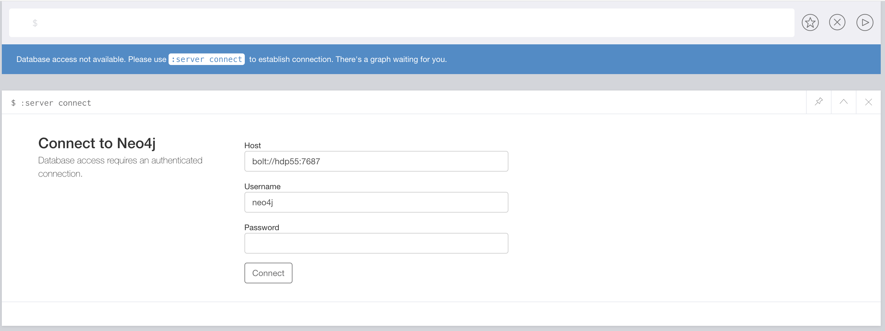
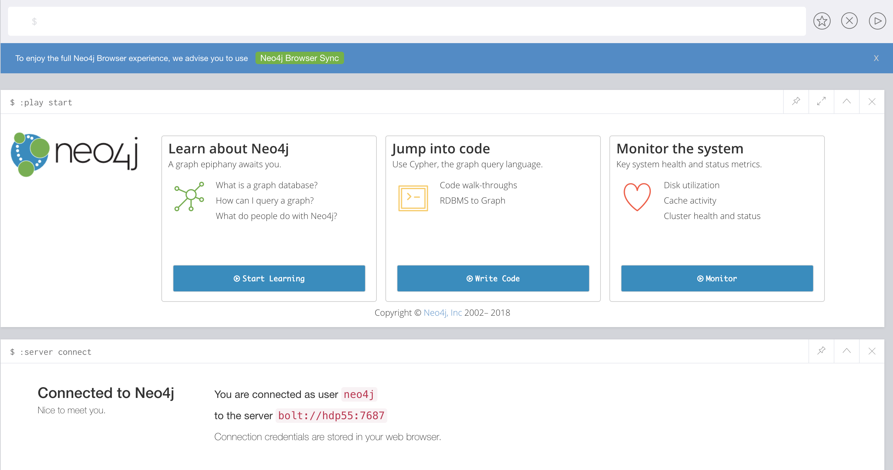

# Neo4j

##  Centos7上安装

### 安装准备

jdk1.8

neo4j/3.3.5 下载地址：https://we-yun.com/doc/neo4j/3.3.5/

### 安装

##### 解压

```shell
tar -zxvf neo4j-community-3.3.5-unix.tar.gz 
```

##### 修改配置文件

```shell
cd neo4j-community-3.3.5/
cd conf
vim neo4j.conf
```

```shell
#*****************************************************************
# Network connector configuration
#*****************************************************************

# With default configuration Neo4j only accepts local connections.
# To accept non-local connections, uncomment this line:
dbms.connectors.default_listen_address=0.0.0.0

# You can also choose a specific network interface, and configure a non-default
# port for each connector, by setting their individual listen_address.

# The address at which this server can be reached by its clients. This may be the server's IP address or DNS name, or
# it may be the address of a reverse proxy which sits in front of the server. This setting may be overridden for
# individual connectors below.
#dbms.connectors.default_advertised_address=localhost

# You can also choose a specific advertised hostname or IP address, and
# configure an advertised port for each connector, by setting their
# individual advertised_address.

# Bolt connector
dbms.connector.bolt.enabled=true
#dbms.connector.bolt.tls_level=OPTIONAL
dbms.connector.bolt.listen_address=0.0.0.0:7687

# HTTP Connector. There must be exactly one HTTP connector.
dbms.connector.http.enabled=true
dbms.connector.http.listen_address=0.0.0.0:7474

# HTTPS Connector. There can be zero or one HTTPS connectors.
dbms.connector.https.enabled=true
dbms.connector.https.listen_address=0.0.0.0:7473

# Number of Neo4j worker threads.
#dbms.threads.worker_count=
```


### 启动

```shell
cd bin
./neo4j start
```


```shell

Active database: graph.db
Directories in use:
  home:         /ztgx/software/neo4j-community-3.3.5
  config:       /ztgx/software/neo4j-community-3.3.5/conf
  logs:         /ztgx/software/neo4j-community-3.3.5/logs
  plugins:      /ztgx/software/neo4j-community-3.3.5/plugins
  import:       /ztgx/software/neo4j-community-3.3.5/import
  data:         /ztgx/software/neo4j-community-3.3.5/data
  certificates: /ztgx/software/neo4j-community-3.3.5/certificates
  run:          /ztgx/software/neo4j-community-3.3.5/run
Starting Neo4j.
WARNING: Max 1024 open files allowed, minimum of 40000 recommended. See the Neo4j manual.
Started neo4j (pid 85057). It is available at http://0.0.0.0:7474/
There may be a short delay until the server is ready.
See /ztgx/software/neo4j-community-3.3.5/logs/neo4j.log for current status.

```


### 访问管理页面

Ip:7474

连接后修改host为服务器ip

密码默认neo4j



