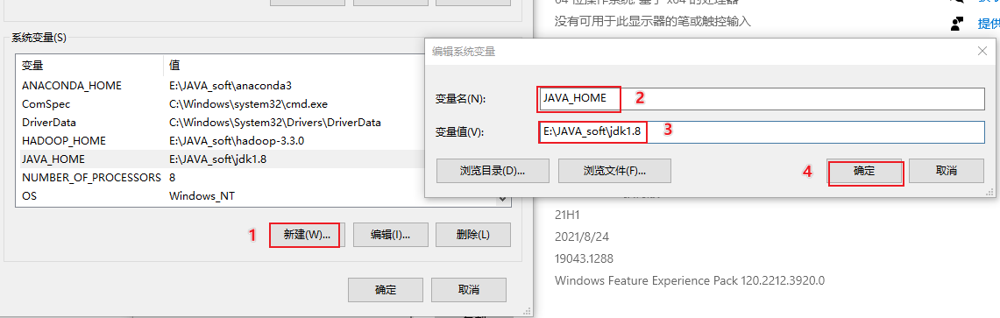

# PySpark

## 1- Spark的基本介绍

### 1.1 什么是Spark

定义: Spark 是一款用于大规模处理的分布式的分析引擎

```properties
MapReduce: 是一款用于大规模的分布式的处理分析引擎

MR存在的弊端:
	1- 计算效率慢: 大量的经过磁盘和内存之间的交互, 基于磁盘计算, IO 比较大(IO密集型框架)
	2- 使用API相对比较低级: 大量的功能代码需要程序员自己完成
	3- 迭代计算非常不方便
	

什么是迭代计算: 
	在计算的过程中, 需要将计算划分为多个阶段, 每一个阶段之间互相依赖, 后一个阶段必须等待前一个阶段执行完成, 然后才能执行后一个阶段
```

​		对于市场来说, 虽然说离线计算对实时性一般要求不高, 但是依然希望能够计算的越快越好, 所以再这样的背景下, 迫切需要一款能够支持大规模的分布式计算, 同时能够有非常高效的迭代计算的性能, 而Spark其实就是在这样的背景下, 开始研发工作

​		Spark最早是来源于加州伯克利分校一帮教授发布的一篇论文而产生的, 论文为 RDD(弹性分布式数据集)

​		

​		RDD: Spark 核心, 也是后续在讲解Spark Core 中最核心的数据结构,  目前可以将其理解为就是一个庞大的容器, 整个迭代计算操作, 都是在这个容器中进行, 整个计算基于内存进行迭代

​		RDD出现, 提供了更加高效的计算平台, 同时也提供了更加高阶的API

​		Spark的开发语言: Scala

​		Spark目前是Apache旗下的顶级开源项目(www.spark.apache.org)


为什么说Spark运行效率优于MR:

```properties
1- Spark提供了全新的数据结构: RDD   支持在内存中进行计算, 在内存中进行迭代计算

2- Spark程序是基于线程来运行, 而MR是基于进程来运行的, 线程的启动和销毁是要高于进程的
```


### 1.2 Spark的发展史


```properties
	PySpark本质上就是一个Pyhton的库, 主要是用于操作Spark, 近年来这个库下载量也是不断提升, 整个使用人群也是在不断的提升, 同时官网已经将python作为操作Spark的第一语言了
```


### 1.3 Spark的特点

* 1- 运行速度快

```properties
原因一:  提供了一个全新的数据结构  RDD(弹性分布式数据集)
	整个计算操作, 基于内存计算, 当内存不足的时候, 可以放置到磁盘上  整个流程是基于DAG(有向无环图)执行方案
	
原因二:  整个Spark是基于线程来运行的, 线程的启动和销毁是优于进程
```

* 2- 易用性:

```properties
原因一: Spark提供了多种操作语言的API:  Python SQL  Scala  Java  R 等

原因二: Spark提供了非常多的高阶API, 而且这些API在不同的语言中操作基本上都是类似的, 大大降低了程序员的学习成本
```

* 3- 通用型:

```properties
	Spark是由多个组件组成的, 主要有 Spark Core  Spark SQL  Spark streaming  Spark MLlib Spark GraphX
	
Spark Core: Spark的核心, 学习Spark的基础, 学习Spark Core主要学习RDD   重点学习部分 (基础)
	主要维护RDD的数据结构
	提供RDD的各种操作API
	提供各种与内存相关的API

Spark SQL: 通过 SQL的方式来操作Spark  离线计算     重点学习部分(应用)

Struct Streaming:  结构化流, 基于Spark SQL  用于进行流式的(实时的)处理组件   较为重要学习部分
	主要处理结构化数据


Spark Streaming:  Spark用于进行流式计算(实时计算)的组件  暂不学习
	在国内, 整个实时计算, 主要是应用在Flink中, 而非 Spark Streaming, 因为Spark的流不是真正的流程, 微批处理

Spark MLlib: Spark用于进行机器学习的库  专门是针对特定人群使用


Spark GraphX:  Spark用于进行图计算的库 专门是针对特定人群使用

```


* 4- 随处运行

```properties
原因一:  编写好的Spark的程序, 可以被提交到多个不同的资源平台上运行:  Local  Spark集群  Yarn 支持其他的云平台

原因二:  Spark框架可以和多种软件进行集成, 集成后, 可以非常方便的对接不同的软件 完成处理

	比如说: 后续可以让Spark对接HIVE , 替换HIVE的执行引擎, 让HIVE 基于Spark运行, 提升效率
```


spark底层的通信框架是基于netty(RPC远程调用框架), 早期版本中是基于 akka


## 2. Spark的环境安装

### 2.0 如何使用今日新的虚拟机

* 1- 接收到三台虚拟机:


* 2- 将这个三个服务器解压到一个没有中文, 没有空格的目录下 (空间需求: 100GB)


* 3- 将服务器挂载到VMware上: 

​	选择每一台节点上的 .vmx后缀的文件, 双击即可, 即可直接加载到VMware上

​	以node1为例, 其他节点都是一模一样


```properties
如果双击后, 长时间, 在VMware上看不到, 解决方案: 将VMware直接关闭, 然后xxx.vmx 双击即可
```

```properties
默认: 每个虚拟机占用 4GB内存  + 2核CPU    不要调小 可以调大, 如果内存不够, 可以调整为  4  3  3 方案
```

* 4- 开启虚拟机, 如果提示我已移动|我已复制,  请注意: 一定一定一定要选择我已移动此虚拟机 (如果选错请重新解压)
* 5- 查看每一台的虚拟机的IP地址和网关地址

```properties
查看路径:  
	cat /etc/sysconfig/network-scripts/ifcfg-ens33
```


* 6 - 修改 VMware的网络地址:  使用vnet8


* 7- 修改windows的对应VMware的网卡地址:


* 8- 通过fineshell 或者其他的连接工具即可连接使用即可, 连接后, 测试一下网络
* 9- 如何需要配置一些windows上的Host地址, 建议配置一下 (每个人都要去校验一下)

```properties
当前我们是需要的: 
	192.168.88.161 node1 node1.itcast.cn
	192.168.88.162 node2 node2.itcast.cn
	192.168.88.163 node3 node3.itcast.cn

需要将这个信息配置到windows的hosts文件中 (不要懒惰....)
```

* 10- 恢复快照(每个人都要做):


其他的二个节点都是需要同时恢复到第七个快照

### 2.1 Local模型安装

​		Local模式本质上运行一个JVM进程, 在一个进程中运行多个线程, 通过线程完成任务的执行

​		Local模式主要应用在开发测试中使用

​		


在安装之前, 需要先将三个虚拟机恢复快照:  每一台都需要同步恢复, 不允许仅恢复一台

以下以node1为例: 


整个安装操作, 请大家参考<<Spark环境部署文档>>


注意: 退出的时候, 请不要使用 ctrl + z  此操作不是退出, 而是挂载到后台

```properties
可以尝试: 
	强制退出: 	
		ctrl + c
		ctrl + d
	
	正常退出: 以下某一个即可退出
		quit
		exit
		:quit
		:exit
		!quit
		!exit
       
    python正常退出: quit()
```


​	说明: 使用spark-shell方式可以进入spark的客户端, 但是 这个客户端编码是需要scala代码的, 但是我们并不会, 我们希望可以使用python代码操作spark, 所以可以使用pyspark的客户端, 但是一执行pyspark, 就报出如下的错误:


```properties
错误:
	没有python3

所以, 如果想要使用pyspark, 需要保证当前服务器必须安装python3的环境
```


### 2.2 PySpark库安装

​		pyspark本质上就是python操作spark的库 要想安装pyspark, 必须先保证当前环境中有python的环境. 而且通过pyspark命令发现, 必须要安装是python3的环境, 当前服务器是否有python环境呢?

```properties
python -V
```


首先第一步, 需要安装python3的环境, python的版本为 3.8.8版本

```properties
本次我们在虚拟机中需要基于anaconda 来安装python的环境

Anaconda（水蟒）：是一个科学计算软件发行版，集成了大量常用扩展包的环境，包含了 conda、Python 等 180 多个科学计算包及其依赖项，并且支持所有操作系统平台。

	anaconda是一个大集成者, 包含有python的环境. 同时还包含python相关各种用于数据分析的库, 一旦使用anaconda可以在一定程度上避免安装各种Python的库
	anaconda提供一种虚拟化的测试, 可以基于anaconda虚拟出多个python的环境, 而且各个环境都是相对独立的 我们称为沙箱环境
	
为什么需要使用虚拟环境: 
	是因为python各个版本都是互相不兼容, 比如说python2 和python3 不兼容 甚至大家都是python3, 但是python3.8 无法兼容python3.7
```


接下来安装 python的环境, 参考部署文档 

```properties
发现:
	即使没有安装pyspark的包, 但是依然可以通过pyspark命令进入python操作spark界面, 所以可以说 spark安装包应该是自带pyspark的环境
```


扩展: anaconda的相关的命令:

```properties
1- 如何安装python的库: 
	pip install -i 镜像地址 -y  包名
	conda install  包名

2- 如何卸载python的库:
	pip uninstall  包名
	conda uninstall  包名

3- 当使用anaconda下载python库的, 可以提前设置下载镜像地址: 
	conda config --add channels https://mirrors.tuna.tsinghua.edu.cn/anaconda/pkgs/free/
	conda config --set show_channel_urls yes

4- 如何基于conda 查看当前安装了那些python库
     查看所有: 
          conda list
     查看是否安装某一个库: 
     	  conda list | grep 包名
 
5- 如何使用conda创建一个虚拟环境:
     conda create 虚拟环境名称 python=版本号

6- 如何查询目前有那些虚拟环境
     conda env list
    
7- 如何进入虚拟环境中:
      source activate 虚拟环境名称 
      conda activate 虚拟环境名称

8- 退出虚拟环境
      conda deactivate
```


说明:

```properties
为什么需要在node1上安装pyspark呢?  
	原因: 后期我们使用pycharm开发spark的程序代码 pycharm需要连接python的环境, 后期主要基于pycharm实现远程连接环境, 在连接远端环境后, 编写spark程序的时候, 就需要导入pyspark的库, 但是服务器的python环境中并不存在pyspark
	
	所以说: 我们安装pyspark的库. 主要目的是为了给pycharm进行使用的. 方便在pycharm进行编写代码(提示), 同时也可以直接在pycharm中进行运行操作
```


演示:  尝试将spark提供的官方测试python脚本提交到spark的local上, 检测spark是否可以正常的运行

```properties
cd /export/server/spark/bin/
./spark-submit --master local[*] /export/server/spark/examples/src/main/python/pi.py  100
```


注意事项:

```properties
	由于我安装软件的问题, 导致提供的虚拟机中, 关于pyspark的库安装了pyspark3.2.1版本, 但是实际上pyspark应该是3.1.2版本, 两个版本在部分API上无法兼容
	所以如果不需要重新安装环境, 直接使用虚拟机后续的快照, 请注意, 需要将原有pyspark卸载掉, 然后重新安装pyspark3.1.2版本
	
	如何卸载: 三个节点都要处理
		pip uninstall pyspark
		pip install -i https://pypi.tuna.tsinghua.edu.cn/simple pyspark==3.1.2
```


### 2.3 Spark集群模式架构


```properties
1- Spark的集群架构: 是一个高可用的分布式的主从集群架构

2- 明确集群中主节点和从节点的作用

3- 明确主节点是如何基于zk进行主备管理的
```


## 3. 基于Pycharm完成PySpark案例

### 3.0 如何清理远端环境


以上就删除远端所有的配置了, 那么如何在重新加回来呢?


最后配置自动提交:


### 3.1 Pycharm连接远程环境

背景说明: 

```properties
	一般在企业中, 会存在两套线上环境, 一套环境是用于开发(测试)环境, 一套环境是用于生产环境, 首先一般都是先在开发测试环境上进行编写代码, 并且在此环境上进行测试, 当整个项目全部开发完成后(阶段开发完成后), 需要将其上线到生产环境中, 面向使用者
	
	如果说还是按照之前的本地模式开发方案, 每个人的环境可能都不同, 导致整个团队无法统一一套开发的环境,从而导致后续在进行测试, 上线的时候, 出现各种各样的环境问题
	
	pycharm提供了一种解决方案: 远程连接方案, 允许所有的程序员都去连接远端的测试环境, 确保大家的环境都是统一的, 避免各种环境问题的发生,而且由于是连接的远程环境, 所有在pycharm编写代码 都会自动上传到远端服务器中, 在执行代码的时候, 相当于是直接在远端环境上进行执行操作
	
注意: 
	本次这里配置远端环境, 指的连接虚拟机中虚拟环境, 可以配置为Base环境, 也可以配置为其他的虚拟环境, 但是目前建议配置为base环境, 因为base环境自带python包更全面一些
```


检测是否OK:


后期如果发现, 已经打上勾了, 但是依然无法自动上传代码, 可以执行手动上传方案


最后, 构建项目:


### 3.2 WordCount代码实现_Local

#### 3.2.1 WordCount案例流程实现


#### 3.2.2 编写代码实现

```properties
from pyspark import SparkContext, SparkConf
import os

os.environ['SPARK_HOME'] = '/export/server/spark'
os.environ['PYSPARK_PYTHON'] = '/root/anaconda3/bin/python3'
os.environ['PYSPARK_DRIVER_PYTHON'] = '/root/anaconda3/bin/python3'

# 程序的入门: pyspark的程序, 必须要有程序入门
# 快捷键: main + 回车
if __name__ == '__main__':
    print("pyspark的入门案例: WordCount")

    # 1. 创建SparkContext核心对象:  spark Core 核心对象
    conf = SparkConf().setAppName('pyspark_wd').setMaster('local[*]')
    sc = SparkContext(conf=conf)

    # 2. 执行相关的操作:
    # 2.1 读取外部文件的数据
    # 路径写法: 协议 + 路径
    """
        本地路径协议: file:///
        HDFS路径协议: hdfs://node1:8020/
        
        注意: 此处的路径, 千万不要写windows的路径地址, 因为咱们连接的远端环境, 所以这里的本地路径指的是linux本地路径
        
        textFile: 一行一行读取操作
    """
    rdd_init = sc.textFile(name='file:///export/data/workspace/gz11_pyspark_parent/_01_spark_base/data/words.txt')
    """
        获取到结果:
        [
            'hadoop hadoop hadoop hive hive', 
            'hive hadoop hive sqoop sqoop', 
            'hadoop hue hue sqoop hive', 
            'hive hive sqoop hue zookeeper', 
            'zookeeper hive sqoop oozie', 
            'ooize oozie hive hive'
        ]

    """
    # print(rdd_init.collect())

    # 2.2  对数据执行切割操作
    # flatMap : 一转多的时候
    rdd_flatMap = rdd_init.flatMap(lambda line: line.split(' '))
    """
        flatMap执行两个操作, 先将每一行数据转换为一个列表, 然后将列表压扁, 形成一个大列表操作
        
        第一步:
        [
            ['hadoop,hadoop,hadoop,hive,hive'], 
            ['hive,hadoop,hive,sqoop,sqoop'], 
            ['hadoop,hue,hue,sqoop,hive'], 
            ['hive,hive,sqoop,hue,zookeeper'], 
            ['zookeeper,hive,sqoop,oozie'], 
            ['ooize,oozie,hive,hive']
        ]
        第二步: 压扁, 将里面的列表干掉, 统一通过一个列表来保存
        结果为:
        [
            'hadoop', 'hadoop', 'hadoop', 'hive', 'hive', 
            'hive', 'hadoop', 'hive', 'sqoop', 'sqoop', 
            'hadoop', 'hue', 'hue', 'sqoop', 'hive', 
            'hive', 'hive', 'sqoop', 'hue', 'zookeeper', 
            'zookeeper', 'hive', 'sqoop', 'oozie', 
            'ooize', 'oozie', 'hive', 'hive'
        ]

    """
    # print(rdd_flatMap.collect())

    # 2.3 执行转换操作: 将每一个单词转换为 (单词,1)
    # map: 用于对列表中数据 进行一对一转换操作, 转换的方案取决于你传入的函数
    rdd_map = rdd_flatMap.map(lambda word : (word,1))
    """
        结果为:
        [
            ('hadoop', 1), ('hadoop', 1), ('hadoop', 1), ('hive', 1), 
            ('hive', 1), ('hive', 1), ('hadoop', 1), ('hive', 1), ('sqoop', 1), 
            ('sqoop', 1), ('hadoop', 1), ('hue', 1), ('hue', 1), ('sqoop', 1), 
            ('hive', 1), ('hive', 1), ('hive', 1), ('sqoop', 1), ('hue', 1), 
            ('zookeeper', 1), ('zookeeper', 1), ('hive', 1), ('sqoop', 1),
            ('oozie', 1), ('ooize', 1), ('oozie', 1), ('hive', 1), ('hive', 1)
        ]

    """
    # print(rdd_map.collect())

    # 2.4  根据key进行分组聚合操作
    rdd_res = rdd_map.reduceByKey(lambda agg,curr: agg + curr)
    """
        reduceByKey: 根据key进行分组, 然后将一个组内的value合并为一个列表, 然后执行 传入的lambda函数
            参数1: 表示局部聚合的结果, 一开始默认为value列表中第一个值 
            参数2: 表示每一次遍历的值, 默认从value列表中第二个开始遍历
            agg + curr  其实 底层写法: agg = agg + curr
        结果: 
        [('hadoop', 5), ('hive', 10), ('hue', 3), ('zookeeper', 2), ('sqoop', 5), ('oozie', 3)]
    """
    # 3. 打印结果
    print(rdd_res.collect())

    # 4- 释放资源
    sc.stop()
```


可能出现的错误:


```properties
原因: 找不到JAVA_HOME环境

解决方案:  需要在代码中指定远端的环境地址 以及 在node1环境中初始化JAVA_HOME地址
	第一步: 在mian函数上面添加以下内容
	os.environ['SPARK_HOME'] = '/export/server/spark'
	os.environ['PYSPARK_PYTHON'] = '/root/anaconda3/bin/python3'
	os.environ['PYSPARK_DRIVER_PYTHON'] = '/root/anaconda3/bin/python3'
	
	第二步:在node1的 /root/.bashrc 中配置初始化环境的配置
	=export JAVA_HOME=/export/server/jdk1.8.0_241
```


### 3.3 [扩展]部署windows开发环境

* 1- 第一步: 需要安装Python 环境 , 建议使用anaconda 来安装即可 

* 2- 第二步: 在Python安装pySpark

```properties
执行:
	pip install pyspark==3.1.2
```


* 3- 第三步: 配置 hadoop的环境


```properties
首先, 需要将 hadoop-3.3.0 放置到一个没有中文, 没有空格的目录下

接着将目录中bin目录下有一个 hadoop.dll文件, 放置在c:/windows/system32 目录下  (配置后, 需要重启电脑)

最后, 将这个hadoop3.3.0 配置到环境变量中: 
```


配置后, 一定一直点确定退出, 否则就白配置了....

* 4-第四步: 配置spark本地环境


```properties
首先, 需要将 spark-3.1.2... 放置到一个没有中文, 没有空格的目录下

最后, 将这个 spark-3.1.2... 配置到环境变量中:
```


配置后, 一定一直点确定退出, 否则就白配置了....

* 5-配置pySpark环境

```properties
需要修改环境变量
```


配置后, 一定一直点确定退出, 否则就白配置了....


* 6- 配置 jdk的环境:


```
首先: 需要将 jdk1.8 放置在一个没有中文, 没有空格的目录下

接着:要在环境变量中配置 JAVA_HOME, 并在path设置
```




